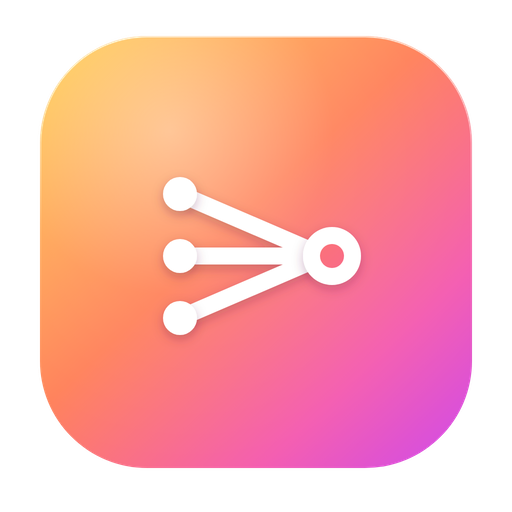
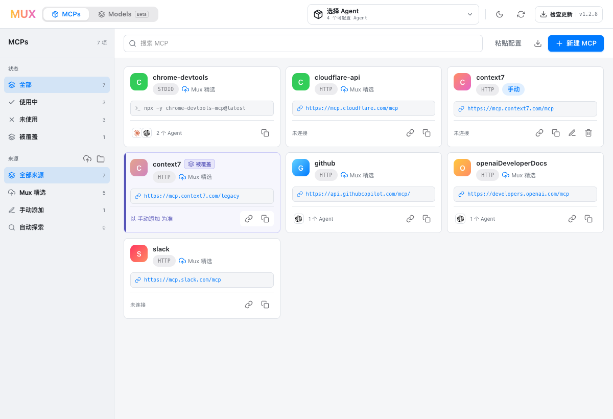
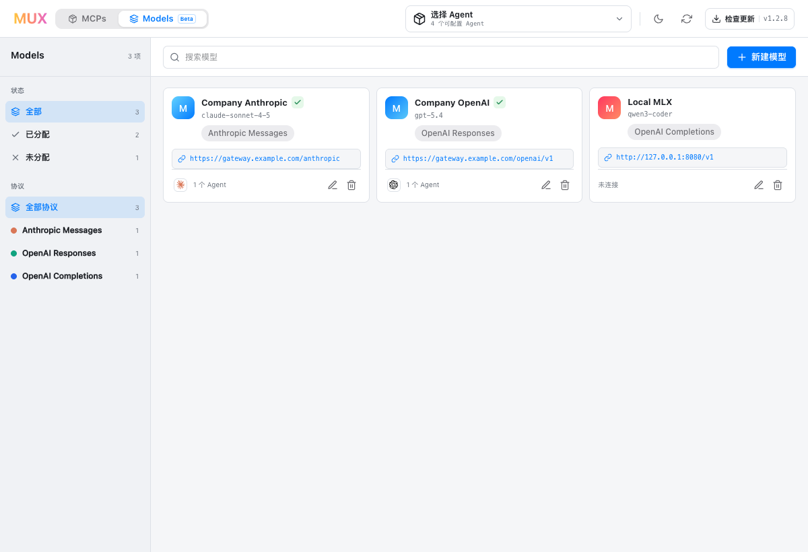
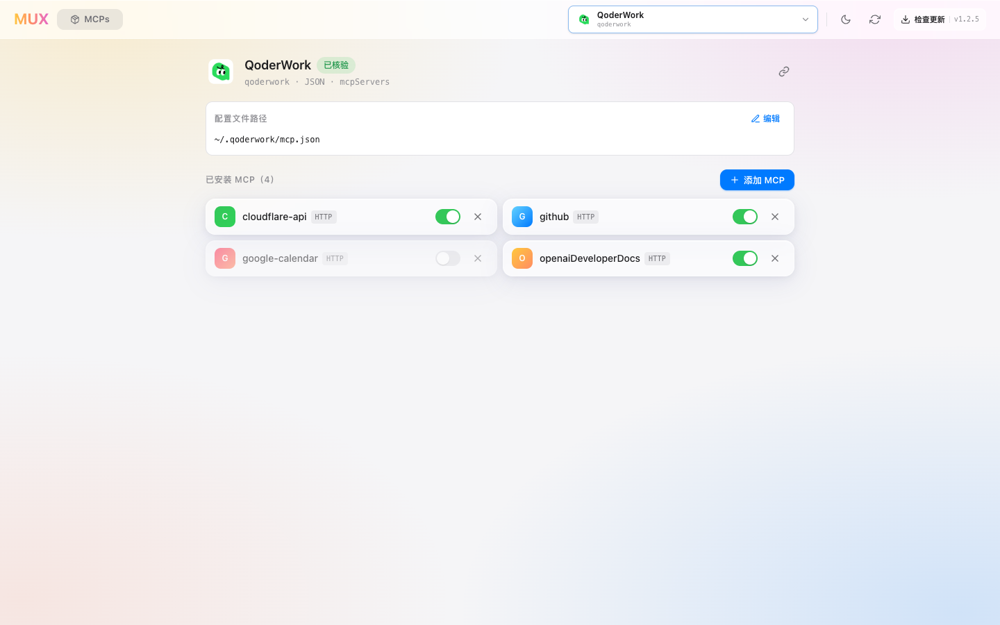

# MUX — MCP Multiplexer

**Manage MCP servers and reusable model endpoints for your AI agents in one place.**

MUX is an MCP configuration manager for Claude Code, Codex, Cursor, QoderWork,
OpenCode, and many other AI agents. Install, enable, synchronize, and export MCP
servers from one catalog while MUX adapts each agent's native config format. It
patches only the MCP section and preserves the rest of your settings.

The desktop preview also manages reusable model endpoint profiles for Claude
Code, Codex, and Pi. Credentials stay in macOS Keychain; Qoder is detected and
linked to its official interactive `/model` setup until it exposes a secure
non-interactive writer.

MUX ships as **two front-ends that share the same data** (`~/.mux/`):

- 🖥️ a **macOS desktop app** (Tauri + React) — a visual manager, and
- ⌨️ a **CLI + TUI** (`mux`, a native Rust binary) — an interactive terminal UI
  plus scriptable subcommands.

Use either interface to install, toggle, or remove MCP servers across supported
agents from the same catalog.

---

## Sources, not a hardcoded list

MUX doesn't bundle a fixed server list. Your catalog is **assembled from sources** you control:

| Source | What it is |
|--------|------------|
| **订阅 (Subscribe)** | A **URL** to an MCP config file. MUX fetches + caches it; refresh re-pulls upstream. |
| **本地 (Local)** | A config file **imported from disk** — copied into MUX; refresh re-reads the original. |
| **手动添加 (Manual)** | Servers you create by hand or **paste** in — stored as a managed local source. |
| **自动探索 (Discovered)** | Servers already configured in your agents, **auto-detected** on launch. |

A one-click **Mux 精选 (curated collection)** subscribes you to a curated set. Every source can be toggled on/off; the Registry shows the union of all enabled sources.

## Features

- **Aggregated catalog** with search, source filtering, and an explicit view of copies shadowed by precedence.
- **Per-agent** install / enable / disable / delete. *Disable* first saves the server's complete semantic entry, including Agent-owned policy fields, then removes it from the Agent file so it can be restored safely.
- **Transport-aware** — `stdio` / `http` / `sse`, plus a **custom `type`** (e.g. `streamable-http`). Same-named stdio and http variants are tracked separately.
- **Paste a config** — drop a `{"mcpServers": {…}}` block and MUX recognizes the servers and adds them.
- **Edits propagate** — changing a catalog entry's connection config re-stamps it into every active global install, including drifted copies; failed targets are reported instead of silently counted as synced.
- **Safe, local writes** — MUX reads and edits only the configured MCP entry on this machine. It never uploads the complete agent config. Existing files are backed up first, then atomically replaced only if they have not changed concurrently; unrelated keys, comments, formatting, servers, policy fields, permissions, and symlinks are preserved.
- **Unified agent configuration center** — see the verified agent/model path and MCP path together, then assign a compatible model and manage MCPs without switching workflows.
- **Reusable model endpoints (preview)** — define a protocol, Base URL, model ID, and optional token limits once, then apply compatible profiles from Models or a supported Agent page. API keys are stored only in macOS Keychain.
- **CLI ⇄ Desktop in sync** — both are built on one shared Rust core (`mux-core`) and read/write `~/.mux/`, so a change in one shows up in the other.
- **Dark mode** and a compact, consistent resource workspace for MCPs and Models.

## Screenshots







See the [desktop app guide](website/guide/desktop.md) for Agent search, source
filtering, and shadowed-configuration screenshots.

## Supported agents

MUX retains **194 distinct MCP client records** for discovery and verification. Of those, **42 are deeply audited definitions** and **41 have verified, writable global config targets** with native JSON, TOML, or YAML schemas; only those writable targets appear in the desktop Agent picker. MUX never guesses a path or writes a generic schema into the remaining discovery-only records.

Audited targets include Claude Code/Desktop, Codex, Cursor, VS Code, Zed, Windsurf, Gemini CLI, Google Antigravity, Amazon Q, OpenCode, Grok Build, MiniMax Code, Copilot CLI, Cline, Continue, Goose, Hermes, Kimi Code, Qwen Code, Qoder Desktop, Qoder CLI, QoderWork, Mistral Vibe, Rovo Dev, Tabnine, LM Studio, and others. Claude Desktop and BoltAI local files accept stdio only. Pi is explicitly labeled as a community `pi-mcp-adapter` target because Pi core does not ship MCP support. Devin remains discovery-only because no stable user-level global config file is documented.

See the [complete audited matrix](website/guide/agents.md) and [catalog methodology](docs/agent-catalog.md). Every writable target's global path remains editable; paths inside the home directory are normalized to the portable `~/…` form.

---

## Desktop app

Grab the **Desktop installer · Apple Silicon** asset from the latest stable [**Release**](../../releases/latest). The app checks that stable channel automatically and also exposes a manual **Check for updates** action. Installing the app makes its bundled `mux` CLI available through `~/.local/bin/mux` when that directory is on `PATH`.

Build from source:

```bash
cd desktop
npm install
npm run tauri build      # or: npm run tauri dev
```

## CLI

The `mux` CLI is a native Rust binary built on the same `mux-core` as the desktop app. It is bundled with the desktop app, can be downloaded separately from Releases, or built from source:

```bash
cargo install --path cli    # installs the `mux` binary onto your PATH
# or just build it:
cargo build --release -p mux-cli   # → target/release/mux
```

Everything runs against `~/.mux/`, shared with the desktop app.

Run `mux` with **no arguments** for the **interactive TUI** — a keyboard-driven
terminal manager with three screens (Registry / 来源 / Agents): browse and search
the catalog, install to agents (multi-select), enable / disable / delete, edit or
paste catalog entries, and manage sources and agents. Press `?` for the keymap,
`q` to quit. (Set `MUX_NO_TUI=1` to fall back to printing help in scripts.)

Or drive it non-interactively with subcommands:

```bash
mux import          # scan agents and import discovered servers
mux list            # list catalog entries
mux apply <names…>  # apply MCPs to global agent configs (--agent)
mux add <name>      # add a server to the manual source
mux remove <name>   # remove a manual entry
mux status          # show what's active across agents
mux export [--out <file>]  # export the effective catalog as JSON
mux clean [--agent <name>]   # clear MCPs from enabled agents
mux agents [list | enable <name> | disable <name>]
mux upgrade         # upgrade a standalone CLI from the latest stable Release
```

---

## Data layout

Everything lives under `~/.mux/`:

```
~/.mux/
├── settings.json           # agents · sources · model profile metadata · state
├── sources/
│   ├── remote/<id>.json    # cached copies of subscribed URLs
│   └── local/<id>.(json|toml)   # imported local files + the managed manual/discovered sources
└── backups/                # per-agent timestamped backups made before existing-file writes
```

Model API keys are not stored under `~/.mux/`; they remain in macOS Keychain.

## How it works

1. **Add sources** — subscribe to a URL, import a file, add the official collection, create/paste a server by hand, or let MUX auto-discover what's already in your agents.
2. **Browse the catalog** — the Registry aggregates every enabled source (precedence: external sources < discovered < your manual edits).
3. **Install to an agent** — pick an agent, toggle servers on/off; MUX writes only that MCP entry using the Agent's native schema (backing up existing files first).
4. **Stay in sync** — enable/disable/edit/remove flow through `~/.mux/`, visible to both the CLI and the desktop app.

## Development

A Cargo workspace plus the Tauri desktop app:

```
core/           # mux-core — the shared Rust core (types, settings, sources, adapters, ops)
cli/            # mux-cli  — the clap-based `mux` binary, built on mux-core
desktop/        # Tauri v2 (Rust, depends on mux-core) + React 19 + Vite + Tailwind v4
data/           # audited agent definitions + discovery catalog + curated MCP collection
```

The desktop app is a separate build (`exclude`d from the workspace) so its Tauri bundle output path stays put.

```bash
cargo test                            # mux-core + mux-cli
cd desktop/src-tauri && cargo test    # Rust core + integration tests (desktop)
cd desktop && npm run build           # desktop frontend (tsc + vite)
node scripts/update-agent-catalog.mjs # refresh the public client discovery catalog
```

## License

[MIT](LICENSE) © Scoheart
