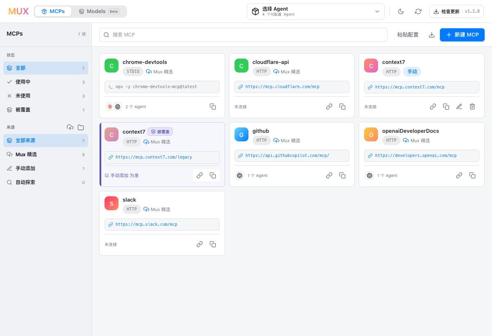
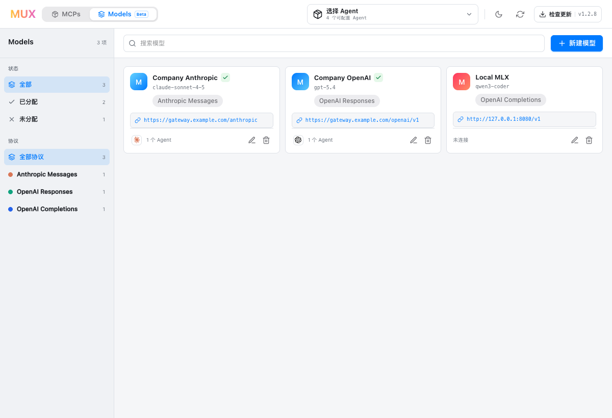
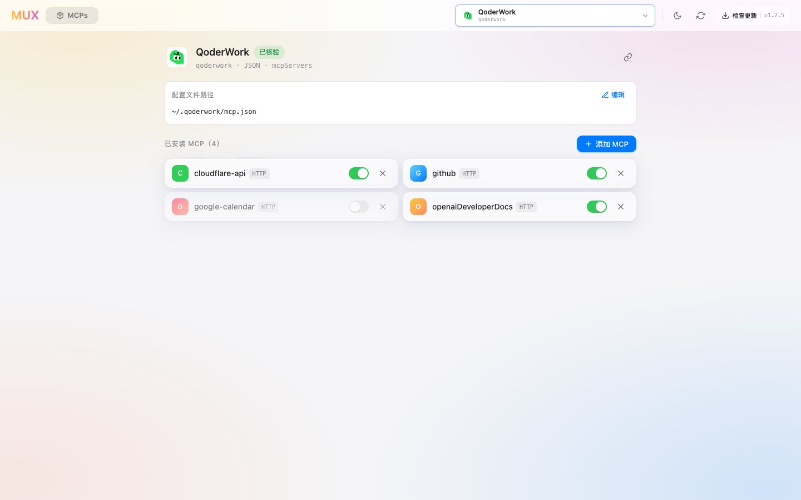

# MUX — Agent Resource Manager

**Configure MCP servers, reusable model endpoints, and user-level Agent Skills once, then let each Agent consume those central assets.**

MUX is a central asset and Agent configuration manager for Claude Code, Codex,
Cursor, QoderWork, OpenCode, and many other AI agents. MCPs, Model Profiles, and
Skills are created and maintained in their top-level libraries; each Agent then
selects which compatible assets it should consume. MUX adapts that desired state
to the Agent's native format while preserving unrelated settings.

Model credentials managed by MUX stay in macOS Keychain. Agents without a safe
Keychain command receive only a non-secret environment-variable reference; MUX
never exports the secret or edits shell startup files. Primary model selection
is managed independently from fork, small, auxiliary, and other secondary model
slots. Skills are downloaded
from GitHub or imported from local folders and archives directly into one managed copy. MUX
still validates paths, archive structure, hashes, and concurrent changes in the
background. Assigning that copy to verified Agent directories remains a
separate operation, so an Agent page never asks you to reinstall the same Skill.

MUX ships as **two front-ends that share the same data** (`~/.mux/`):

- 🖥️ a **macOS desktop app** (Tauri + React) — a visual manager, and
- ⌨️ a **CLI + TUI** (`mux`, a native Rust binary) — an interactive terminal UI
  plus scriptable subcommands.

Both frontends enter through the same revisioned workspace, capability graph,
startup recovery, and plan/commit/cancel application boundary. External MCP,
Model, and Skill changes use the same explicit per-item contract: `mux discover`
is read-only, while each domain's `converge` command adopts, restores, or detaches
one exact observation. The no-argument TUI is an MCP-focused terminal workspace;
Desktop remains the richer visual editor for central Model and Skill lifecycle
operations.

---

## Central sources and external observations

MUX doesn't bundle a fixed server list. Its central MCP catalog is assembled from sources you control, while Agent files remain an independent observed-state input:

| Source | What it is |
|--------|------------|
| **订阅 (Subscribe)** | A **URL** to an MCP config file. MUX fetches + caches it; refresh re-pulls upstream. |
| **本地 (Local)** | A config file **imported from disk** — copied into MUX; refresh re-reads the original. |
| **手动添加 (Manual)** | Servers you create by hand or **paste** in — stored as a managed local source. |
| **外部发现 (External)** | Servers already present in Agent files, scanned as read-only observed state. MUX detects them automatically and offers explicit per-item management. |

A one-click **Mux 精选 (curated collection)** subscribes you to a curated source. Managed sources can be toggled on/off; the Registry shows their effective union, while external Agent observations remain read-only until the user reviews and manages one exact item. MUX never bulk-adopts detected Agent configurations.

## Features

- **Aggregated catalog** with search, source filtering, and an explicit view of copies shadowed by precedence.
- **Central assets, explicit consumers** — create or import assets once, then manage each Agent's desired MCP/Skill/Model sets from that Agent's page. Asset Inspectors keep lifecycle and impact read-only.
- **Transport-aware** — `stdio` / `http` / `sse`, plus a **custom `type`** (e.g. `streamable-http`). Same-named stdio and http variants are tracked separately.
- **Paste a config** — drop a `{"mcpServers": {…}}` block and MUX recognizes the servers and adds them.
- **Desired vs. observed state** — Agent files and Skill links are scanned for `synced`, `external-added`, `external-changed`, `external-removed`, `unparseable`, `ambiguous`, and `unsupported`; scans never silently create ownership.
- **Normal external change tracking** — newly added, removed, toggled, or edited MCPs, Models, and Skills refresh in place. Every changed relationship exposes only the safe core-projected actions: adopt observed state, restore MUX desired state, or detach ownership.
- **Reviewed propagation** — editing or deleting a central MCP or Model plans the central change together with every consumer. Ordinary central edits never overwrite drift; an exact convergence operation must resolve the affected relationship first.
- **Safe, local writes** — MUX reads and edits only fields it owns. Existing files are backed up, prepared, and verified as one recoverable transaction; unrelated keys, comments, formatting, policy fields, permissions, and symlinks are preserved.
- **Unified Agent consumption center** — each Agent page shows only desired central assets under MCPs, Model, and Skills, with a central picker for relationship changes and a separate read-only external section.
- **Reusable model connections (preview)** — define one Provider Base URL, shared credential, and an editable Endpoint Path for every enabled protocol; Models then reference that connection with only their model ID and optional token limits. Native multi-model Agents can keep several Profiles installed, enable or disable each one, and choose exactly one current primary model; Claude Code and Codex retain their single-Profile contract.
- **User-level Skills in Desktop** — download a public GitHub repository or directly import a local folder or `.zip` / `.tar.gz` / `.tgz` / `.tar` archive without Git, Node.js, or `npx`; assign the central copy to Agents in a separate step.
- **One proxy for MUX networking** — configure HTTP, SOCKS4/SOCKS4A, or SOCKS5 once for GitHub Skills, remote sources, CLI updates, and signed Desktop update checks; credentials are never stored in `settings.json`.
- **CLI ⇄ Desktop on one application core** — both use the same bootstrap, Agent capability graph, revisioned MCP/Model/Skill snapshot, typed errors, and recoverable operation coordinator.
- **Dark mode** and a compact, consistent resource workspace for MCPs, Models, and Skills, with shared cards, right-side Inspectors, and review dialogs only for consequential existing-asset changes.

## Screenshots







See the [desktop app guide](website/guide/desktop.md) for Agent search, source
filtering, and shadowed-configuration screenshots.

## Supported agents

MUX tracks **211 unique Agent identities** across its reviewed sources: **56 deeply audited definitions** and **201 discovery-catalog entries**, with 46 IDs overlapping. Of the audited definitions, **46 have verified, writable global MCP targets** with native JSON, TOML, or YAML schemas; the remaining audited definitions are Skills-only targets or the explicit read-only Devin record. MUX never guesses a path or writes a generic schema into discovery-only records.

Audited targets include Claude Code/Desktop, Codex, Cursor, VS Code, Zed, Windsurf, Gemini CLI, Google Antigravity, Amazon Q, OpenCode, Grok Build, MiniMax Code, Copilot CLI, Cline, Continue, Goose, Hermes, Kimi Code, Qwen Code, Qoder Desktop, Qoder CLI, QoderWork, Mistral Vibe, Rovo Dev, Tabnine, LM Studio, and others. Claude Desktop and BoltAI local files accept stdio only. Pi is explicitly labeled as a community `pi-mcp-adapter` target because Pi core does not ship MCP support. Devin remains an audited read-only record because no stable user-level global config file is documented.

MUX exposes **14 Model targets**. Managed Model Profile configuration is available
for Claude Code, Codex, Grok Build, Pi, OpenCode, Kilo Code CLI, Qwen Code,
Crush, Mistral Vibe, Hermes Agent, Factory Droid, and Goose. MiniMax Code and
Qoder are the two guided targets because their available
configuration surfaces do not provide a safe equivalent writer for this flow.

Models use a shared Provider architecture: one Provider owns its name, type,
single Base URL, enabled protocol Endpoint Paths, environment reference, and
single Keychain credential, while any number of Models reference it by stable
`providerId`. Editing a Provider reapplies every affected Agent transactionally.
MUX refuses to disable a protocol while a named Model still uses it. Existing
same-origin protocol endpoints migrate to Base URL + Endpoint Path without
changing request targets; a legacy Provider with multiple origins is left
untouched and must be split explicitly. If an Agent's native schema can only
represent a client Base URL, MUX also blocks custom paths it cannot preserve
exactly instead of silently ignoring them.

See the [complete audited matrix](website/guide/agents.md) and [catalog methodology](docs/agent-catalog.md). Every writable target's global path remains editable; paths inside the home directory are normalized to the portable `~/…` form.

Skill consumption supports **45 separately verified user-level Agent capabilities** across CLI, IDE, and desktop products. Only capabilities detected on the current machine appear, and Agents sharing one physical compatibility directory are selected and reviewed as an inseparable impact group. Managed links expose one live central copy, so consumer-side edits are detected as central drift rather than isolated copies. See the [Skills guide](website/guide/skills.md).

---

## Desktop app

Grab the **Desktop installer · Apple Silicon** asset from the latest stable [**Release**](../../releases/latest). The app checks that stable channel automatically and also exposes a manual **Check for updates** action. Installing the app makes its bundled `mux` CLI available through `~/.local/bin/mux` when that directory is on `PATH`.

MUX uses a permanent direct Stable flow. A validated `main` push automatically creates the next patch release commit, Draft, and immutable `vX.Y.Z` tag. That tag starts one macOS package build and the asynchronous Quality suite in parallel; there is no per-commit Pre-release or rolling Release PR. Stable publication still requires release provenance, version consistency, signing, App/DMG inspection, updater and CLI packaging, complete-asset validation, and semantic-version latest-channel ordering.

Build from source:

```bash
cd desktop
npm ci
npm run tauri build      # or: npm run tauri dev
```

## CLI

The `mux` CLI is a native Rust binary built on the same `mux-core` as the desktop app. It is bundled with the desktop app, can be downloaded separately from Releases, or built from source:

```bash
cargo install --path cli    # installs the `mux` binary onto your PATH
# or just build it:
cargo build --release -p mux-cli   # → target/release/mux
```

Everything runs against `~/.mux/`, shared with the desktop app.

Run `mux` with **no arguments** for the **interactive TUI** — an MCP-focused,
keyboard-driven terminal workspace with three screens (Registry /
Sources / Agents). Browse and search the MCP catalog, install to Agents, enable,
disable, or delete entries, and manage MCP sources and Agent targets. Press `?`
for the keymap and `q` to quit. Set `MUX_NO_TUI=1` to print help instead when a
script invokes `mux` without arguments.

Or drive it non-interactively with subcommands:

```text
mux mcp {list,show,status,assign,unassign,enable,disable,converge,add,delete,export}
mux model {list,show,status,assign,unassign,enable,disable,converge,use}
mux skill {list,show,status,assign,unassign,enable,disable,converge}
mux agent {list,enable,disable}
mux discover [mcp|model|skill]
mux workspace
mux upgrade
```

All Agent-relationship writes use exact stable asset IDs and exactly one explicit
`--agent <id>`. `assign` adds only the named relationships; `unassign` removes
only those relationships; `enable` and `disable` preserve the relationship.
For MCP only, `mux mcp unassign --all --agent <id>` performs a reviewed,
target-scoped clear of managed, disabled, and external MCP entries while
leaving the central catalog and every other Agent unchanged.
`mux model use <profile-id> --agent <id>` selects the current Model independently
of assignment. `converge <asset-id> --agent <id> <adopt|restore|detach>` is the
shared explicit reconciliation verb; repeating `assign`, `enable`, or `use`
never repairs or overwrites external changes as a side effect.
Skill plans report every installed Agent affected by a shared
physical Skills directory. MCP IDs always include transport, such as
`github::stdio`; a same-named HTTP variant is a separate asset and is never
selected implicitly. Every convergence plan binds the inventory revision and
re-scans before commit, so a changed observation returns `observation_stale`.

The global `--json`, `--yes`, `--dry-run`, and `--no-color` options support
machine output, reviewed automation, plan-only runs, and deterministic terminal
output. Any command that writes—including `mux mcp export --out`—requires
interactive confirmation or an explicit `--yes` / `--dry-run`. See the
[complete CLI guide](website/guide/cli.md).

Model schema upgrades migrate central MUX data and credentials without rewriting
the Agent's current files. Those files are scanned afterward as ordinary observed
state. A capability-local migration or parser failure isolates that capability;
only damaged shared settings or an incomplete transaction that cannot be safely
recovered make the whole workspace read-only.

---

## Data layout

Everything lives under `~/.mux/`:

```
~/.mux/
├── settings.json           # agents · sources · central metadata · desired consumption state
├── sources/
│   ├── remote/<id>.json    # cached copies of subscribed URLs
│   └── local/<id>.(json|toml)   # imported local files + the managed manual/discovered sources
├── skills/                 # one managed central copy per Skill
├── staging/skills/         # resolved Skill candidates and internal Skill operations
├── staging/consumption/    # reviewed cross-domain plans and durable rollback snapshots
├── backups/                # timestamped backups made before managed writes
│   └── skills/             # reversible Skill replacements, imports, and removals
└── journals/skills/        # crash-recovery progress for committed Skill operations
```

Skills-specific runtime paths:

```text
~/.mux/skills/                  managed Skill contents
~/.mux/staging/skills/          staged candidates and internal operation plans
~/.mux/backups/skills/          reversible replacements/removals
~/.mux/journals/skills/         crash recovery journals
```

Model API keys are not stored under `~/.mux/`; they remain in macOS Keychain.

The three resource types share one typed state contract in Core rather than a
second on-disk manifest. Asset operations persist semantic revisions only for
the exact central assets, their reverse consumer sets, Agent relationships,
target graph, and credential presence they reviewed. Unrelated UI, network,
Agent, or other state outside those semantic subjects does not invalidate that
review. MCP source precedence, the single managed Skill tree, and Keychain
credentials remain in their native authoritative stores.

## How it works

1. **Build the central libraries** — subscribe or import MCP sources, create Model Profiles, and directly download or import Skills. No Agent target is changed during central intake.
2. **Choose consumers** — from an Agent page or the CLI, select compatible assets. MCPs and Skills are sets; supported multi-model Agents also keep a Model Profile set plus one independent current pointer.
3. **Review only meaningful risk** — routine reversible Agent relationship changes sync directly with inline progress; conflicts, removals from shared Skill directories, and disruptive Model changes still show their exact impact before commit.
4. **Commit and verify** — settings, Agent targets, and central lifecycle changes are applied as a recoverable transaction and return their verified inventory before reporting success.
5. **Converge external state explicitly, one item at a time** — MUX detects unmanaged and externally changed MCPs, Model Profiles, and user-level Skills without changing ownership. Adopt, restore, or detach one exact revision-bound observation through a recoverable transaction.
6. **Propagate central lifecycle changes** — updates reach every desired consumer; deletion clears all managed targets and relationships instead of leaving implicit orphan copies.

Skills in this version are user-level only. Project-level Skills, private repositories, and Skill editing are not supported. The CLI can query and manage Agent consumption for MCPs, Models, and Skills, and explicitly converge one detected change at a time. Central Model and Skill authoring remains in Desktop, while the no-argument TUI is MCP-focused.

## Development

A Cargo workspace plus the Tauri desktop app:

```
core/           # mux-core — domain contracts, application facade, resource engines, transactions
  src/domain/       # IO-free Agent/resource/relationship/error contracts
  src/application/  # bootstrap, workspace snapshot, capability graph, plan/commit/cancel
  src/resources/    # MCP/Model/Skill-specific engines (MCP codecs no longer occupy root)
  src/assets/       # cross-domain desired/observed relationships and coordinator
cli/            # mux-cli  — the clap-based `mux` binary, built on mux-core
desktop/        # Tauri v2 (Rust, depends on mux-core) + React 19 + Vite + Tailwind v4
data/           # audited agent definitions + discovery catalog + curated MCP collection
```

The desktop app is a separate build (`exclude`d from the workspace) so its Tauri bundle output path stays put.

```bash
cargo test                            # mux-core + mux-cli
cd desktop/src-tauri && cargo test    # Rust core + integration tests (desktop)
cd desktop && npm run build           # desktop frontend (tsc + vite)
node scripts/update-agent-catalog.mjs # refresh the public client discovery catalog
```

## License

[MIT](LICENSE) © Scoheart
