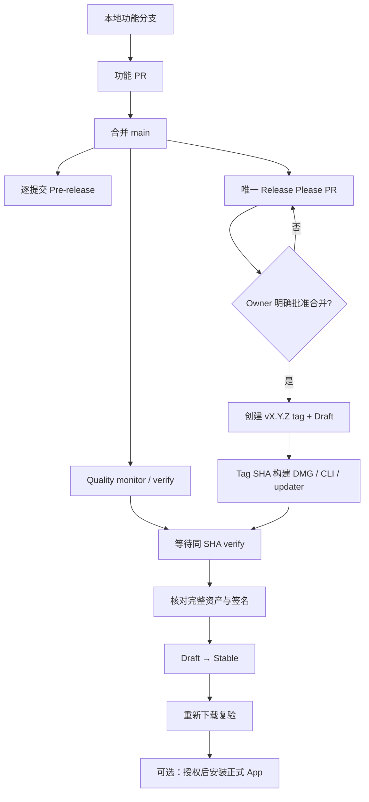

# MUX 正式版发布流程

## Overview

MUX 的正式发布是两段式交付：普通功能 PR 先合入 `main`，触发逐提交 Pre-release，并由 Release Please 维护唯一滚动 Release PR；只有 owner 单独批准并合并该 Release PR，才会创建不可移动的 `vX.Y.Z` tag 与 Draft Release。tag 触发 macOS 构建，工作流等待同一 SHA 的 `verify` 成功，核对 DMG、CLI、updater payload 与 `latest.json` 后，最后一步才把 Draft 发布为 Stable。

当前中央资产实现仍位于本地分支 `codex/central-asset-consumption-design`，工作树未提交，因此若要发布这批功能，入口是“提交并合并功能 PR”，不是直接创建正式 tag。

## Relevant files

- `AGENTS.md:35` — Git、版本所有权、Stable 授权与禁止手工修复规则。
- `.github/workflows/release-please.yml:3` — `main` 合并后创建或更新唯一 Release Please PR，并刷新 lockfile。
- `.github/workflows/quality-monitor.yml:21` — Rust、Desktop、Website 三组检查及聚合 `verify`。
- `.github/workflows/build-desktop.yml:29` — 区分普通 main、Stable tag 与手动 retry，并构建/验证/发布资产。
- `.github/scripts/wait-for-verify.sh:25` — 要求发布所用准确 commit SHA 的唯一 `verify` 成功。
- `.github/scripts/publish-release-assets.sh:86` — 只接受既有 Stable Draft，幂等核对资产后最后发布。
- `release-please-config.json:1` — 单包、`v` tag、Draft Release 与版本文件同步规则。
- `scripts/release-version.mjs:13` — `version.txt` 与 Rust/Tauri/Desktop manifests、lock metadata 的一致性门禁。
- `desktop/src-tauri/tauri.conf.json:29` — Stable updater 只读取 GitHub latest Release 的 `latest.json`。

## Core analysis

### 1. 功能代码通过普通 PR 进入 main

功能分支应先完成测试、审查、commit 和 push，再创建普通 PR。功能 PR 不直接修改 `version.txt` 或 release-owned manifest；仓库规则要求普通功能通过 PR 进入 `main`（`AGENTS.md:35-41`）。

普通 PR 合并到 `main` 后会并行触发：

1. `Quality monitor`：Rust、Desktop、Website，最终聚合成精确名为 `verify` 的 check（`.github/workflows/quality-monitor.yml:21-103`）。
2. `Build desktop`：普通 main commit 被分类为 `prerelease`，生成 `v<current-version>-build.<run-number>`（`.github/workflows/build-desktop.yml:63-74`）。
3. `Release Please`：根据 Conventional Commits 创建或更新唯一滚动 Release PR（`.github/workflows/release-please.yml:17-35`）。

Pre-release 只上传 DMG 与 CLI，不生成 `latest.json`，因此不会进入 App 自动更新通道（`.github/workflows/build-desktop.yml:259-291`）。

### 2. Release Please PR 拥有正式版本变更

Release Please PR 负责更新 `version.txt`、CHANGELOG，以及 `core`、CLI、Desktop、Tauri 的版本字段；其配置使用 `simple` release type、`v` 前缀 tag、Draft Release 与单一聚合 PR（`release-please-config.json:1-59`）。随后 workflow 运行 `release-version.mjs refresh-locks`，只在 Release PR 中刷新 Desktop/Cargo lock metadata（`.github/workflows/release-please.yml:37-78`）。

`version.txt` 是版本权威入口。`release-version.mjs check` 要求所有 source manifests、生成的 lock version 和 portable npm dependency closure 一致；Stable 构建还要求 tag 与版本完全匹配（`scripts/release-version.mjs:179-217`、`386-400`）。

如果功能 commit 使用 `feat(...)`，按 Conventional Commits 与 Release Please 的常规语义通常会提议下一个 minor 版本；最终版本仍以实际 Release PR 为准。

### 3. 合并 Release PR 是正式发布授权点

只有 owner 明确批准后才能合并标题为 `chore(main): release X.Y.Z` 的 Release PR。合并必须保持 squash commit subject 严格等于该标题，不能附加 `(#PR)`；分类器同时检查版本发生变化和标题精确匹配，符合时跳过普通 Pre-release 路径（`.github/workflows/build-desktop.yml:63-74`）。

Release Please 合并后创建：

- 不可移动的 `vX.Y.Z` tag；
- 指向同一 SHA 的 Stable Draft Release。

禁止手工创建、移动或覆盖正式 tag，也禁止直接手工发布 Draft；失败应修复后发新的 patch，或仅在既有 tag 上使用受控 `stable-retry`（`AGENTS.md:37-41`）。

### 4. Stable tag 触发正式构建

`vX.Y.Z` tag 触发 `Build desktop`，分类器只接受严格的 Stable tag 格式，并从该 tag checkout 源码（`.github/workflows/build-desktop.yml:75-94`、`120-129`）。构建过程：

1. 校验 tag 与所有版本元数据一致；
2. `npm ci`；
3. 使用 GitHub Secrets 中的 Tauri updater 私钥构建 App 与 DMG；
4. 核对 App version、bundled `mux --version`、deep strict codesign；
5. 校验 DMG checksum，readonly 挂载 DMG 后再次验证里面的 App；
6. 构建并按稳定文件名打包 CLI。

对应实现见 `.github/workflows/build-desktop.yml:161-251`。当前 `tauri.conf.json` 使用 ad-hoc macOS signing identity `-`；updater minisign 私钥是另一套签名机制（`desktop/src-tauri/tauri.conf.json:29-45`）。

### 5. 必须等待相同 SHA 的 verify

打包完成并不代表可发布。工作流调用 `wait-for-verify.sh`，只接受同一 commit SHA、GitHub Actions 创建、名称为 `verify` 的唯一 check；失败、歧义或超时都会停止发布（`.github/scripts/wait-for-verify.sh:25-60`）。

### 6. 先补全 Draft，最后原子发布 Stable

Stable 路径生成 updater tarball 与 `latest.json`；manifest 含版本、签名和 updater asset URL（`.github/workflows/build-desktop.yml:293-327`）。随后 `publish-release-assets.sh`：

1. 查找 tag 对应且仍为 Draft、非 Pre-release 的唯一 Release；
2. 要求恰好存在一份 installer、CLI、updater payload、`latest.json`；
3. 已有同名资产只能在 SHA-256 完全相同时复用，禁止覆盖；
4. 上传缺失资产并再次核对完整资产集合和 label；
5. 最后才设置 `draft=false`。

见 `.github/scripts/publish-release-assets.sh:86-161`。这保证用户不会看到缺资产的半成品 Stable。

### 7. 发布后复验与可选安装

发布后仍应从 GitHub Release 重新下载四项资产，核对 API digest、实际版本、架构、DMG、App/sidecar codesign、updater URL 与签名；不能只依据 Actions 绿灯结束。`latest.json` 位于 `releases/latest/download/latest.json`，只有最新非预发布 Release 会被 App updater 消费（`desktop/src-tauri/tauri.conf.json:29-34`）。

把已验证 Stable DMG 安装到 `/Applications/MUX.app`、替换现有 App、启动并截图验收，是发布之后的独立外部动作，仍需用户当次明确授权。

## Release flow

## 本批中央资产功能的实际顺序

1. 审查当前未提交 diff，提交到 `codex/central-asset-consumption-design`。
2. push 分支，创建功能 PR，等待 required checks。
3. 合并功能 PR；检查对应 Pre-release，并确认 Release Please PR 已更新。
4. 审阅 Release Please 的版本、CHANGELOG、manifests 与 lockfile；当前功能属于 `feat` 时预计为 minor bump，但以 PR 内容为准。
5. 获得单独授权后，使用严格标题合并 Release PR。
6. 等待 Stable tag workflow 与同 SHA `verify`；不要手工 publish Draft 或覆盖资产。
7. 重新下载并验证四项 Stable 资产与 updater channel。
8. 如需本机可视验收，再单独授权替换 `/Applications/MUX.app` 并截图。

## Failure modes

- Release PR squash subject 被改成带 PR 编号的标题：main commit 会被误分类为额外 Pre-release；v1.3.0 曾发生过此问题。
- 手工改版本字段：`release-version.mjs check` 会因 manifest/lock/tag 不一致而停止。
- `verify` 不是同一 SHA、失败或重复：发布等待脚本拒绝继续。
- Draft 已发布或资产同名但内容不同：发布脚本 fail closed，不会 `--clobber`。
- Pre-release 没有 `latest.json`：这是有意隔离，不能用 Pre-release 测试自动更新 Stable channel。
- updater minisign 与 macOS code signing 混为一谈：前者保护自动更新 payload，当前后者仍是 ad-hoc bundle integrity，并不等同 Developer ID notarization。
