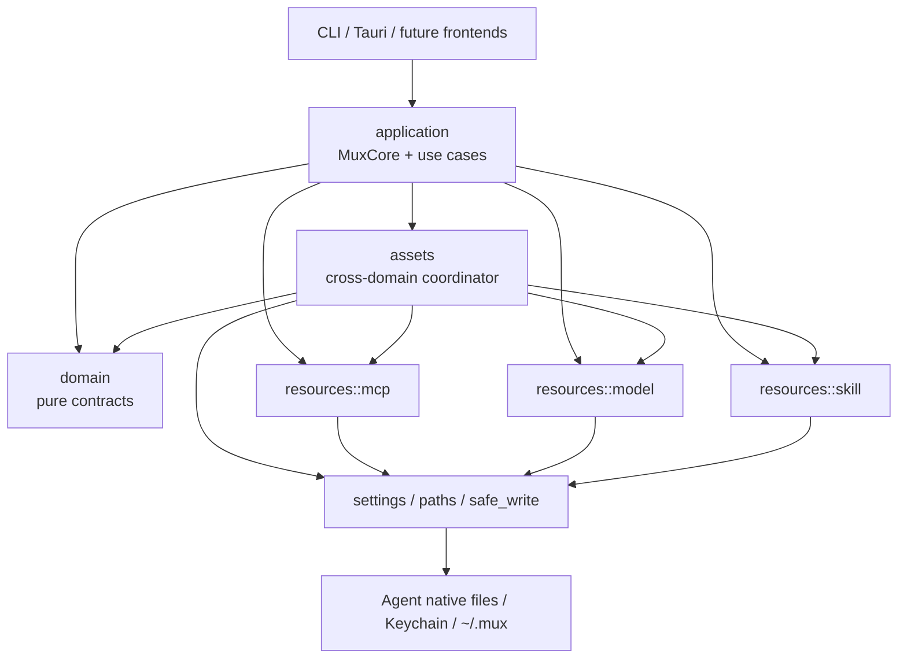
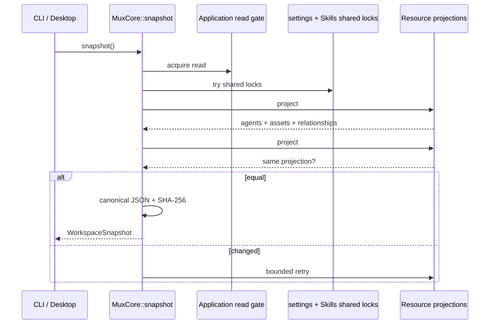

# MUX 1.8.42 当前代码架构

> 分析基线：`d78de07e2b295a2648fde5194e3d7017b847ce00`，版本 `1.8.42`，2026-07-24。
> 本文描述的是当前仓库中实际运行的架构，不是目标蓝图；已经完成的 Core 重构和仍保留的兼容边界会分开说明。

## 结论先行

MUX 现在不是一个“MCP 配置同步器”，而是一个面向 Agent 的本地资源控制面：

1. 在中央管理 MCP、Model、Skill 三类资产。
2. 用 desired relationship 表达“哪个 Agent 应消费哪些资产”。
3. 通过每个 Agent 的专属 adapter/writer 修改它的原生配置。
4. 再扫描真实文件或链接，得到 observed state。
5. 把 desired 与 observed 合并为统一 inventory，判断 `Synced`、`Drifted`、`Conflicted`、`External` 等状态。
6. 中央资产、消费关系和已消费 capability 的重要变更先生成可审阅 plan，再 commit 或 cancel；提交后重新扫描验证。Source administration、Agent enabled 和少量未消费配置管理是受 Core guard 保护的显式例外。

最简心智模型是：

```text
中央资产库
  ├── MCP Registry entries
  ├── Model Profiles
  └── Managed Skills
          │
          │ desired relationship
          ▼
Agent capability + resource-specific adapter
          │
          │ write native state
          ▼
Agent 原生配置 / Skill symlink
          │
          │ scan
          ▼
observed state
          │
          ▼
desired + observed = unified inventory
```

Rust Core 是业务规则和写入安全的唯一权威。CLI、Tauri 和 React 只是入口与展示层，不应自行解释配置格式或直接写 Agent 文件。这个方向已经建立，但前端查询接口和若干兼容 API 尚未完全收敛到单一 workspace façade。

---

## 1. 仓库与构建拓扑

MUX 是一个 Rust Core + 两套用户入口 + 文档站的单仓项目：

```text
mux/
├── core/                 # mux-core：domain、application、资源引擎、事务与存储
├── cli/                  # mux CLI + Ratatui 兼容 TUI
├── desktop/
│   ├── src/              # React 19 / TypeScript / Vite / Tailwind
│   └── src-tauri/        # Tauri 2 Rust command adapter
├── data/                 # 编译期内嵌的 Agent 与 MCP curated 数据
├── website/              # VitePress 文档站
├── scripts/              # 版本、发布与工作流契约脚本
├── .github/workflows/    # 质量、桌面构建、稳定发布
└── analysis/             # 架构与审计记录
```

根 Cargo workspace 只包含 `core` 和 `cli`；Tauri crate 被显式排除，独立构建和测试（`Cargo.toml:1-4`）。这不是说 Desktop 与 Core 分离部署：`desktop/src-tauri` 仍直接依赖 `mux-core`，只是 Cargo workspace 生命周期分开。

| 组件 | 主要技术 | 责任 | 关键入口 |
|---|---|---|---|
| Core | Rust | 业务合同、工作区投影、计划/提交/恢复、Agent adapter | `core/src/lib.rs`、`core/src/application/mod.rs` |
| CLI | Rust、Clap | 脚本式命令、升级、工作区查询 | `cli/src/main.rs` |
| TUI | Ratatui、Crossterm | 无参数 CLI 的 MCP 兼容交互界面 | `cli/src/tui/mod.rs` |
| Tauri | Rust、Tauri 2 | 把 Core use case 暴露为 Desktop commands | `desktop/src-tauri/src/lib.rs` |
| Desktop | React 19、TypeScript | Registry、Model、Skill、Agent UI 与审阅交互 | `desktop/src/App.tsx` |
| Website | VitePress | 用户文档与发布站点 | `website/` |

版本由 `version.txt` 驱动，并同步到 Core、CLI、Desktop package、Tauri Cargo 与 `tauri.conf.json`；lockfile 字段是生成结果（`scripts/release-version.mjs:13-24`）。

---

## 2. Core 的分层与依赖方向

当前 Core 的稳定调用方向如下：



### 2.1 `domain/`：不带 I/O 的业务合同

`core/src/domain/` 只表达 Agent、资产、关系、plan 和错误，不拥有文件系统、Keychain、网络或前端流程（`core/src/domain/mod.rs:1-11`）。

这里最重要的对象有：

- `AssetRef`：统一标识三类资产。
  - MCP：`Mcp { key }`
  - Model：`Model { profile_id }`
  - Skill：`Skill { name }`
- `ConsumptionView`：一条 desired/observed 关系及其状态。
- `Inventory`：中央资产、MUX-owned consumptions 和 external observations。
- `AgentCapabilityView`：一个 Agent 的 MCP、Model、Skill 可选能力集合。
- `DomainPlan`：保持 MCP、Model、Skill 的 typed payload，不把三者压成同一种 map。
- `CoreError`：稳定的 `code`、`message`、`details`、`retry_at` 和 confirmation 结构。

`AssetRef`、状态枚举与 desired/external 分离位于 `core/src/domain/assets.rs:10-133`；Agent 能力模型位于 `core/src/domain/agents.rs:22-128`；统一错误位于 `core/src/domain/error.rs:8-42`。

### 2.2 `application/`：前端应依赖的用例层

`MuxCore` 是无状态 façade，只暴露五个顶层动作：

```rust
MuxCore::bootstrap(...)
MuxCore::snapshot()
MuxCore::plan(request)
MuxCore::commit(request)
MuxCore::cancel(request)
```

定义见 `core/src/application/mod.rs:20-50`。

其中：

- `bootstrap` 固定 migration、recovery 和 reconciliation 顺序。
- `snapshot` 返回统一、带 revision 的工作区事实。
- `plan` 接收 tagged operation request，生成可审阅计划。
- `commit` 只提交已经生成且仍满足 precondition 的计划。
- `cancel` 丢弃尚未开始提交的计划，支持安全重试。

`PlanOperationRequest` 已覆盖中央资产生命周期、Agent consumption、enabled/current、capability 配置、adoption，以及 Skill install/import/assign/update/remove/repair（`core/src/application/operations.rs:21-79`）。`operations.rs:81-220` 再把统一 envelope 分派到 cross-domain asset coordinator 或 Skill 专用引擎。

Application 内仍有 `agents`、`mcp`、`models`、`skills` 等专门 use case。它们是显式应用接口，不等于 frontend 可以进入底层资源 writer。

### 2.3 `assets/`：跨资源的关系与事务协调器

`core/src/assets/` 负责三类资源共有的问题：

- 中央资产与 Agent consumption 的分离。
- desired relationship 的 plan。
- 目标文件、settings、catalog 与中央 draft 的 precondition。
- MCP/Model/Skill 跨域提交。
- rollback evidence、commit marker 和启动恢复。
- desired 与 observed 的统一 inventory。
- 旧 consumption/schema 的显式迁移。

它协调资源引擎，但不抹平资源差异。例如 MCP 写 JSON/TOML/YAML，Model 管 Profile 与 Keychain，Skill 交换目录和 symlink；统一的是操作生命周期，不是底层 wire format。

### 2.4 `resources/`：三类资源的专属引擎

`core/src/resources/mod.rs:1-5` 只声明：

```text
resources::mcp
resources::model
resources::skill
```

每个引擎负责自己的解析、兼容性、写入、扫描和风险规则：

- MCP：source layering、registry、codec、adapter、scanner、applier。
- Model：Profile、Agent writer matrix、native observation、Keychain。
- Skill：source resolve、manifest、inventory、staging、journal transaction。

### 2.5 `settings.rs`、`safe_write.rs`、`paths.rs`：持久化基础设施

这些模块提供：

- `~/.mux` 路径解析与测试隔离。
- 聚合式 `settings.json` 的严格/兼容读取。
- 文件系统锁和进程内锁。
- compare-and-swap 写入。
- 临时文件、fsync、atomic rename。
- 事务写后状态证据与安全 rollback。

### 2.6 `lib.rs`：兼容出口仍在

`core/src/lib.rs:21-77` 仍为旧 integration 保留：

- `mux_core::models`
- `mux_core::skills`
- 根级 MCP 模块别名
- `mux_core::types`
- `mux_core::consumption`

新代码应进入 `application`、`domain`、`assets` 或 `resources::*`。这些 alias 是兼容层，不是当前架构的推荐依赖方向；架构测试禁止 Core 实现重新依赖它们。

### 2.7 非资产型支持模块

Core 还保留几项不属于 MCP/Model/Skill 生命周期的横向服务：

- `network.rs`：校验并保存 HTTP/SOCKS proxy，为 Core 自有 `ureq` 请求统一构建 client；禁止在 proxy URL 中携带用户名或密码（`core/src/network.rs:1-85`）。
- `update.rs`：standalone CLI 从 GitHub stable Release 自更新；若 CLI 位于 Desktop `.app` 内则拒绝单独替换，避免破坏签名和版本一致性（`core/src/update.rs:1-49`）。
- `pinned_agents.rs`：校验和保存最多 6 个可配置 Agent 的 UI pin 顺序，已覆盖 MCP、Skill 和 Model capability（`core/src/pinned_agents.rs:6-71`）。
- `testenv.rs`：测试专用 RAII home 隔离，序列化进程级环境变量并在 Drop 时恢复，防止测试误写真实 `~/.mux`（`core/src/testenv.rs:1-80`）。

### 2.8 能识别出的设计模式

MUX 没有套用单一框架，但实现中有几种清晰模式：

| 模式 | 在 MUX 中的体现 |
|---|---|
| Application Facade | `MuxCore` 把启动、快照和操作生命周期收敛成前端边界 |
| Strategy / Adapter | 根据 Agent definition 选择 MCP codec、Model writer 或 Skill target 规则 |
| Desired-state reconciliation | desired relationship 与 native observed state 合成 inventory |
| Optimistic concurrency | plan hash、target hash、catalog hash、CAS 阻止 stale overwrite |
| Unit of Work | asset transaction 把 settings、Agent 文件、Keychain、link 作为一个恢复单元 |
| Write-ahead journal / state machine | Skill 用 phase journal 恢复目录和 symlink 交换 |
| Anti-corruption layer | `application/error.rs` 和 `lib.rs` compatibility surface 隔离旧 wire/API |

它接近 ports-and-adapters 的依赖思路，但不是严格的 Hexagonal Architecture：资源引擎、settings 和事务仍位于同一个 `mux-core` crate，Application 也会直接调用显式资源 use case。

---

## 3. 运行时对象模型

### 3.1 Agent 不再由 MCP 能力定义

一个 Agent 现在由统一 identity 加三个独立的可选 capability 组成：

```text
Agent
├── identity / display metadata
├── MCP capability?     path + format + codec + layout
├── Model capability?   supported profiles + writer/observe rules
└── Skill capability?   user-level target + aliases
```

因此：

- Model-only Agent 可以进入统一 Agent graph。
- Skill-only Agent 不需要伪造 MCP path。
- MCP、Model、Skill 的兼容性分别判断。
- 配置某一能力不要求另外两种能力存在。

`core/src/application/agents.rs:39-171` 将 MCP definitions、Model views 和 Skill capability views 按 Agent ID 合并为一张 typed capability graph。

### 3.2 中央资产与消费关系严格分开

“资产存在”和“某个 Agent 使用它”是两种状态：

```text
Central asset
    │
    ├── no consumers                    # 只在中央库
    ├── desired by Agent A              # 应写入 A
    ├── desired by Agent B, disabled    # 关系存在但停用
    └── externally observed in Agent C  # 发现但未接管
```

这条边界带来几个重要语义：

- 下载一个 Skill 不会自动把它链接给所有 Agent。
- 新建 Model Profile 不代表它已安装到任一 Agent。
- MCP source 中出现 entry 不代表 MUX 已接管 Agent 内同名配置。
- 扫描到外部配置不会自动生成中央资产或 desired relationship。

### 3.3 desired、observed、external

统一关系投影包含两个独立事实：

- desired：settings 中声明 MUX 应管理的关系。
- observed：真实 Agent 配置或链接中观察到的状态。

二者合成状态：

| 状态 | 含义 |
|---|---|
| `Synced` | desired 与 observed 一致 |
| `Pending` | 为操作中间态预留；当前 inventory 实现尚没有分支产出这个状态 |
| `Drifted` | MUX-owned 字段被外部改变 |
| `Conflicted` | 当前状态不能安全自动覆盖 |
| `Unsupported` | Agent 能力或安全契约不支持该操作 |
| `External` | 只观察到，MUX 没有所有权 |

这些状态定义于 `core/src/domain/assets.rs:75-133`。当前 desired target 缺失会投影成 `Drifted`，不是 `Pending`（`core/src/assets/inventory.rs:88-103,225-259,390-416`）。External 保持单独集合，核心原则是“发现不等于接管”。

### 3.4 三类资产的 identity

| 域 | 稳定 identity | 说明 |
|---|---|---|
| MCP | `name::stdio` 或 `name::http` | 同名不同 transport 是不同资产，见 `core/src/domain/assets.rs:65-72` |
| Model | MUX 生成且不可变的 `profile.id` | Agent 原生 ID 只有 adoption 后才进入 `native_ids` |
| Skill | manifest `name` | 必须与 Skill 目录名一致 |

Model 的“已安装 Profile 集合”与“当前 Profile”也是两种状态：`profiles[profile_id]` 表示 consumption，`active_profile_id` 表示当前指针；当前项失效时执行确定性 fallback（`core/src/domain/assets.rs:143-188`）。

三类资源的具体 source of truth 如下：

| 域 | 中央资产 | desired relationship | observed state |
|---|---|---|---|
| MCP | `~/.mux/sources/{remote,local}` 中的 source cache；`settings.sources` 保存来源定义 | `settings.mcp_consumptions[agent][name::transport]`，含 enabled 与 overrides | Agent JSON/TOML/YAML 中的 MCP section；禁用快照另存 `settings.disabled` |
| Model | `settings.model_profiles` 元数据；MUX 自管的 per-Profile credential 在 macOS Keychain，environment-reference Profile 只保存 `env_key` 名称 | `settings.model_consumptions` 保存安装/启用集合，`model_assignments` 保存 active pointer | Agent 原生 provider/model entry 与 current/default pointer |
| Skill | `~/.mux/skills/<name>` 内容；`settings.managed_skills` 保存 source、hash、risk 等 metadata | `settings.skill_assignments[name] = physical target IDs` | Agent Skills 目录中的 symlink、external directory 或 broken/conflicting link |

Settings 字段和兼容说明见 `core/src/settings.rs:64-126`。

---

## 4. 统一只读路径：Workspace Snapshot

`WorkspaceSnapshot` 返回：

```text
revision
agents          # capability graph
assets          # central MCP / Model / Skill
relationships   # desired / observed / external
```

定义位于 `core/src/application/workspace.rs:17-32`。

一次 projection 的关键步骤是：



实现细节：

1. Skill inventory 每个 projection 只扫描一次，并复用于 Agent capability 和关系投影（`workspace.rs:34-49`）。
2. settings 与 Skills 使用 shared filesystem lock，协调遵守 MUX 锁协议的其他进程。
3. 两把锁通过 non-blocking try-lock 获取；若只拿到一把，就释放后重试，避免与不同 writer 锁序形成死锁。
4. 外部 Agent 进程不会遵守 MUX 锁，所以 Core 要求连续两次 projection 相等。
5. canonical JSON 统一对象 key 顺序，再计算 SHA-256 revision（`workspace.rs:51-65`）。
6. 连续 projection 不同就有界重试，持续变化后返回 `snapshot_unstable`；这能降低混合读取概率，但不能证明得到数据库级一致切片。
7. 对一个全新的 MUX home，snapshot 不应创建目录或 settings；这是只读契约。

需要准确理解 revision：它是“本次返回内容的稳定指纹”，不是跨所有 Agent 文件的数据库级 MVCC token，也不是所有 plan 默认使用的全局 CAS 版本。具体 operation 仍绑定自己需要的 settings、target、catalog 和 candidate hashes。

---

## 5. 统一写路径：Plan → Commit / Cancel → Verify

### 5.1 外层协议

中央资产、消费关系和 Skill 生命周期等重要 mutation 遵循：

```mermaid
sequenceDiagram
    participant UI as Frontend
    participant App as MuxCore
    participant Plan as Planner
    participant Tx as Transaction
    participant Native as settings / Agent / Keychain
    participant Inv as Inventory

    UI->>App: plan(request)
    App->>Plan: read current state
    Plan->>Plan: compatibility + drift + impact
    Plan-->>UI: reviewed OperationPlan
    alt user confirms
        UI->>App: commit(operation id + hashes + confirmation)
        App->>Tx: verify plan/preconditions
        Tx->>Native: apply recoverable mutations
        Tx->>Inv: rescan postconditions
        Inv-->>Tx: verified
        Tx-->>UI: OperationCommitResult
    else user cancels
        UI->>App: cancel(operation id)
        App-->>UI: CoreResult&lt;()&gt;
    end
```

一个中央 asset plan 通常绑定：

- operation ID 与 request。
- settings hash。
- 所有目标文件/link 的 before hash。
- MCP effective/source catalog hash（仅 MCP）。
- lifecycle draft hash。
- candidate hash。
- drift、conflict、replacement 或 high-risk confirmation。

planner 的持久化结构和 hash 绑定见 `core/src/assets/planner.rs:36-132,1048-1189`；commit 的 stale 检查见 `core/src/assets/transaction.rs:974-1051`。

没有伪装成 asset plan 的显式 administration 边界包括 Source subscribe/refresh、Agent catalog enabled，以及新建或编辑尚未被消费的 Agent definition。它们仍经过 Application write gate、settings/file precondition 和资源层 guard；一旦会影响已有 desired consumer，就 fail closed，要求改走 reviewed asset/capability operation。

### 5.2 提交阶段

cross-domain asset transaction 的主流程是：

1. 获取进程级 commit lock 和跨进程 settings lock。
2. 校验 operation request、candidate hash、可提交状态和 confirmation。
3. 重新检查 settings、Agent targets、MCP catalog 与 domain before-state。
4. 保存 settings、目标文件、Skill link、credential 的 rollback snapshot。
5. 开启 post-state ownership tracking。
6. 按资源类型 apply。
7. 重新生成 inventory，验证 postcondition。
8. 写 commit marker。
9. 清理 staging 和 pending in-memory payload。

对应实现位于 `core/src/assets/transaction.rs:46-181`。

失败后的 rollback 不是“无条件覆盖回来”。对文件、link 和 settings，只有当前状态仍等于 MUX 刚写出的 exact post-state，事务才能证明写入所有权并回滚；如果用户或另一个进程已经继续修改，Core 保留恢复证据并进入 recovery-required，避免把新数据覆盖掉。

Keychain 不具备同等的 exact-value ownership 证明：MUX 只安全检查 credential 是否存在，无法区分“同样存在但已被别的进程替换”的值。因此恢复含 Model credential 的事务时采用更保守的整体 rollback/fail-closed 策略，而不是声称对 Keychain 也完成了精确 post-state 归属判断（`core/src/assets/transaction.rs:235-259`）。

### 5.3 为什么 Skill 还有第二套事务引擎

外层 plan/commit/cancel 是统一的，但 Skill 操作目录、symlink、retained backup 和风险 findings，不能用普通配置文件事务替代。

Skill transaction 使用：

```text
Prepared
  → ContentSwapped / LinksSwapped
  → SettingsWritten
  → cleanup
```

- 安装/更新：`ContentThenLinks`
- 删除：`LinksThenContent`

顺序差异用于避免删除时留下指向不存在内容的消费窗口。提交会重建当前 plan，验证 reviewed hash，并在 high-risk 情况下要求精确 findings hash。journal phase 与主执行链见 `core/src/resources/skill/transaction.rs:54-69,835-935`；恢复判断见 `transaction.rs:3995-4053`。

---

## 6. 启动、迁移与恢复

所有前端共用固定 bootstrap 顺序（`core/src/application/bootstrap.rs:56-113`）：

```text
1. settings legacy migration
2. registry → sources migration
3. Skill transaction recovery
4. cross-domain asset recovery
5. Model v2 schema migration
6. active Model reconciliation
```

前两项是 best-effort 兼容迁移 helper，返回 `void`，内部错误不会进入 `BootstrapStage` 的 warning/error envelope；结构化 stage reporting 从 Skill recovery 开始（`bootstrap.rs:11-17,63-81`；`core/src/resources/mcp/registry.rs:238-260`）。因此“固定执行顺序”不等于六个阶段拥有完全相同的错误可见性或 fail-closed 行为。

Bootstrap 的策略因前端不同：

- CLI：遇到未解决事务直接 fail closed，不继续执行命令。
- Desktop：允许诊断界面启动并显示 warning，但关闭后台 Skill update，避免在不确定状态上继续写。

恢复并不盲目选择 rollback：

- 已有 commit marker：视为已经提交，完成清理。
- 尚未开始写且没有 rollback manifest：安全取消。
- 有足够 before/post evidence：根据实际文件状态 rollback 或 finish commit。
- 无法证明：保留证据，返回 recovery-required。

这体现了 MUX 的基本取舍：恢复期间优先保护用户的新修改，而不是追求“看起来自动修好了”。

---

## 7. MCP 资源域

### 7.1 Registry 已经是 source-driven

MCP effective Registry 的来源优先级从低到高为：

```text
外部 source 列表顺序
       <
discovered managed local source
       <
manual managed local source
```

同一 `name::transport` 的最后一个副本生效。实现位于 `core/src/resources/mcp/registry.rs:133-171`。

仓库 `data/registry.json` 是可选择导入的 curated official collection，不再是隐式默认 catalog（`registry.rs:12-27`）。`read_registry_all()` 会保留每个 shadow copy 及 `in_effect` 标记，供 UI 解释覆盖关系（`registry.rs:174-208`）。

因此“删除 MCP”有两层语义：

- 删除某个 source copy，可能只是让低优先级 fallback 重新生效。
- 删除逻辑中央资产，则需要走 lifecycle plan，并传播到所有 desired consumers。

Source administration 不能绕过统一审阅流改变一个正在被消费的 effective key；若变更会影响已有 desired relationship，操作 fail closed，要求先走中央资产流程或解除消费。

### 7.2 Agent 写入契约是审计数据驱动的

MCP Agent 定义来自：

- `data/agent-catalog.json`：201 个广泛 discovery records。
- `data/agents.json`：56 个经过审计的可写 definitions。

合并时 audited definition 覆盖 catalog；catalog 自带的 Skills 写能力会被移除，避免“能发现路径”被误当成“知道如何安全写”（`core/src/agents.rs:58-145`）。

`AgentDefinition` 描述：

- 配置路径。
- JSON/TOML/YAML 格式。
- section key。
- map/list layout。
- identity field。
- codec。
- transport policy。
- root defaults。
- Skills capability 和 aliases。

定义见 `core/src/domain/types.rs:245-318`。路径 override 与 codec contract 分开，改变本地路径不会顺便改变 wire schema。

### 7.3 Adapter 与 codec

MCP adapter 根据 Agent definition 选择 JSON、TOML、TOML-list 或 YAML 策略（`core/src/resources/mcp/adapter.rs:37-89`）。

写入原则：

- 一次只 upsert/remove 一条 server。
- 只改 codec 声明为 controlled 的字段。
- 尽量保留其他 entries、Agent policy、未知字段和注释。
- disable 前保留原始 snapshot。
- 无法安全 round-trip credential 的格式拒绝接管。

具体 controlled field 和 native codec 位于 `core/src/resources/mcp/codec.rs:7-245`；敏感格式的 fail-closed 判断位于 `codec.rs:247-267`。

### 7.4 Adoption 与 drift

外部 MCP 与中央定义精确相等时，adoption 只建立 desired relationship，不重写 Agent 文件。这可以避免一次没有实际价值的序列化破坏（`core/src/assets/transaction.rs:918-947,1135-1194`）。

若是自定义外部项，scanner 会先用目标 codec 做 round-trip normalization，再判断是否 customized；它不会因为 key 相同就直接宣告 synced。

---

## 8. Model 资源域

### 8.1 Profile 与 credential 分离

`ModelProfile` 保存：

- provider/vendor/protocol。
- base URL。
- model。
- Agent native IDs。
- 环境变量引用名。

它不保存 API Key（`core/src/domain/types.rs:17-46`）。MUX 自管的 per-Profile credential 放在 macOS Keychain：

```text
service = com.scoheart.mux.model-profile.<profile-id>
account = api-key
```

写入 `/usr/bin/security` 时 secret 从 stdin 传入，不出现在 argv、日志或 shell history（`core/src/resources/model/mod.rs:512-525,609-660`）。

当前非 macOS 环境没有等价的真实 secure credential store，因此相关能力会被限制。对 Grok/OpenCode 等只支持 environment reference 的 Agent，真正的 secret 由 Agent 进程从外部环境变量读取，Profile 只保存 `env_key` 名称，MUX 只写 `{env:VAR}` 一类官方引用；如果 Profile 只有 Keychain credential 而没有 `env_key`，消费会被拒绝（`core/src/resources/model/mod.rs:921-955`）。

### 8.2 多 Profile 与 current pointer

Model desired state 是：

```text
Agent Model selection
├── profiles
│   ├── profile A: installed, enabled
│   └── profile B: installed, disabled
└── active_profile_id: A
```

“安装哪些 Profile”和“当前选哪个”互相独立。旧 `model_assignments` 会投影进新 consumption 结构，写回时仍维护 legacy active pointer，以兼容旧版本（`core/src/settings.rs:128-182`）。

Profile ID 由 MUX 生成且编辑时不可变；`native_ids` 只能通过 adoption 建立，避免普通编辑把一个已管理 Profile 重定向到另一个 Agent provider key（`core/src/resources/model/mod.rs:260-324`）。

### 8.3 Writer ownership

Model adapter 只拥有：

- MUX 派生或明确 adopted 的 provider/model entry。
- 文档化的 primary/current pointer。

未知字段、辅助模型槽位和用户自定义配置保持不动；credential 只写环境引用（`core/src/resources/model/adapters.rs:1-52`）。

Drift 检测也不是把完整文件与固定模板比较，而是：

1. 读取当前原文。
2. 在原文上准备“如果 MUX 再应用一次”的 candidate。
3. 比较 candidate 与原文。
4. 因为 candidate 保留非 owned 字段，所以差异集中代表 writer-owned drift。

实现见 `core/src/resources/model/mod.rs:1355-1423`。

### 8.4 Model Agent matrix 仍主要硬编码

当前 managed writer 覆盖 Claude Code、Codex、Grok Build、Pi、OpenCode、Kilo、Qwen、Crush、Vibe、Hermes、Factory 和 Goose；MiniMax Code、Qoder 为 guided 模式，因为没有满足安全要求的非交互 writer 或会涉及明文 secret（`core/src/resources/model/mod.rs:1012-1233`）。

与 MCP 相比，Model capability、默认路径、prepare/apply/clear/observe 分支更依赖 Rust `match`。这降低了新增 Agent 的数据驱动扩展速度，但也让每个 Agent 的 credential 和 current-pointer 安全语义都能逐一审计。

### 8.5 中央 Model 更新顺序

中央 Profile 更新的关键顺序是：

```text
保存 metadata
→ 重写所有 desired consumers
→ 最后更新 Keychain
```

Keychain 放在最后，使此前崩溃时旧 credential 仍然存在；一旦 credential 更新，metadata 和 Agent native state 已经达到可验证的 committed state（`core/src/assets/transaction.rs:447-524`）。

---

## 9. Skill 资源域

### 9.1 一份中央内容，多条消费链接

Skill 中央内容只有一份：

```text
~/.mux/skills/<name>/
```

Agent 侧通常是：

```text
<agent-skills-dir>/<name> -> ~/.mux/skills/<name>
```

因此更新中央 Skill 后，各 consumer 不需要复制整棵目录。运行路径定义于 `core/src/resources/skill/paths.rs:5-89`。

### 9.2 Relationship 保存 physical target

Skill assignment 底层保存的是 physical `target_id`，不是简单 Agent ID。原因是不同 Agent、alias path 或不同表面路径可能解析到同一个真实 Skills 目录。

Target graph 会：

1. 读取 audited Agent Skills capability 的 primary 与 alias paths。
2. 解析最深存在父目录。
3. 按 canonical physical path 合并。
4. 记录 primary Agent 和所有受影响 Agent。

所以 UI 上“给一个 Agent 安装 Skill”可能影响共享同一 physical target 的其他 Agent，而底层只需建立一个 symlink。相关逻辑位于 `core/src/resources/skill/inventory.rs:1478-1607,1664-1757`。

### 9.3 Resolve、中央安装、assignment 是三个阶段

Skill intake 的完整链路是：

```text
resolve_source(GitHub / local / archive)
→ 私有 staging candidate
→ manifest / tree / hash 校验
→ plan central install
→ commit central content
→ separate assignment plan
→ create Agent symlink
```

`plan_asset_install` 明确不接收 Agent IDs，证明“中央资产接入”和“分配给 consumer”是两种操作（`core/src/resources/skill/ops.rs:153-177`）。

在 Unix 上，Staging 使用私有权限、`O_NOFOLLOW`、fsync + rename，并核验打开前后的 inode/device，减少 symlink 与 TOCTOU 替换风险（`core/src/resources/skill/staging.rs:47-112,202-284`）。non-Unix 的安全 staging 路径会明确返回 unsupported，而不是降级为较弱写入（`staging.rs:743-882`）。

### 9.4 Inventory

Skill inventory 区分：

- settings 中登记且中央 hash 一致：managed。
- settings 中登记但中央内容变化：`LocallyModified`。
- 中央目录存在但未登记：`External`。
- 精确指向中央 `<name>` 的 symlink：`Assigned`。
- 外部目录、broken link、指向其他位置：External/Broken/Conflicting。

扫描逻辑位于 `core/src/resources/skill/inventory.rs:536-792,968-1013`。

### 9.5 当前范围

当前 Skill 只支持 user-level：

- 支持 GitHub、local、archive intake。
- 支持中央安装、import、assignment、update、remove、repair。
- 不支持 project-level Skills。
- 不支持 private repositories。
- 不提供 Skill 编辑器。
- 需要 anchored filesystem 安全语义的 Skill transaction 当前只在 Unix 平台执行（`core/src/resources/skill/transaction.rs:879-883`）。

---

## 10. Settings、磁盘布局与写入安全

### 10.1 运行时布局

默认根目录是 `~/.mux`，也可通过 `MUX_HOME` 覆盖（`core/src/paths.rs:3-17`）：

```text
~/.mux/
├── settings.json
├── sources/
│   ├── remote/<id>.json
│   └── local/<id>.(json|toml)
├── skills/<name>/
├── staging/
│   ├── skills/
│   └── consumption/
├── backups/
│   └── skills/
└── journals/
    └── skills/
```

这是 README 中公开的运行契约（`README.md:147-174`）。MUX 自管的 per-Profile credential 不在这个目录，而在 Keychain；environment-reference Agent 的 secret 由外部环境提供。

### 10.2 `settings.json` 的角色

`settings.json` 是 desired state 和中央 metadata 的聚合点，当前包含：

- Agent definitions、enabled、path overrides。
- MCP sources、disabled snapshots、consumptions。
- Model profiles、consumptions、active assignments。
- managed Skills、physical target assignments、update timestamp。
- UI、network 和 legacy migration state。
- `#[serde(flatten)]` 保留的未知顶层字段。

结构见 `core/src/settings.rs:30-126`。修改时遵循 whole-read → mutate → CAS atomic write，避免局部 writer 丢失其他 section 或未来版本字段。

严格读取和 tolerant legacy 读取仍并存（`settings.rs:189-223`）：统一 workspace、inventory 和 mutation 使用 strict load；部分旧只读兼容 API 在损坏时仍可能回退默认值。

### 10.3 并发与持久性机制

| 机制 | 解决的问题 | 主要位置 |
|---|---|---|
| Application `RwLock` | 同一进程的跨引擎一致性窗口 | `application/gate.rs:1-26` |
| settings filesystem lock | 跨进程 settings writer 串行化 | `safe_write.rs:150-218` |
| Skills filesystem lock | Skill inventory、transaction 与 recovery 协调 | `resources/skill/transaction.rs:235-319` |
| optimistic CAS | 审阅后文件变化时拒绝覆盖 | `safe_write.rs:591-610` |
| temp + fsync + rename | 避免半写文件 | `safe_write.rs:665-740,867-952` |
| post-state ownership evidence | 只回滚仍属于本事务的写入 | `safe_write.rs:94-123,367-519` |
| operation hashes | 防止 stale plan 提交 | `assets/planner.rs`、`assets/transaction.rs` |
| Skill journal | 目录/link 交换的崩溃恢复 | `resources/skill/transaction.rs` |

敏感中央 draft 和 credential 不写入普通 operation plan；MCP/Model pending payload 保存在进程内 `PENDING_PAYLOADS`。其中 Model pending credential 使用 `Zeroizing<String>`，MCP draft 的 env/header value 仍是 `RegistryEntry` 内的普通 `String`，这里只保证它们不落 plan 文件（`core/src/assets/lifecycle.rs:23-90`）。代价是这类尚未 commit 的 reviewed plan 不能跨进程重启继续；重启后没有 rollback manifest 的计划会被取消。

---

## 11. CLI 与 TUI

### 11.1 CLI

CLI 顶层命令仍保留大量 MCP 兼容语义，同时已有跨资源入口：

```text
mux import / add / remove / apply / clean / status
mux agents
mux workspace
mux models
mux skills
mux upgrade
```

命令定义与 bootstrap dispatch 位于 `cli/src/main.rs:64-193`。

新的 mutation 路径已经使用统一 façade。例如 `apply` 构造 `EnsureAgentConsumption` plan，再通过共同的 reviewed commit/cancel helper 提交（`cli/src/main.rs:447-462,528-557`）。

需要注意：bulk import、remove、apply、clean 当前按 item 逐个 plan/commit。前面的 item 成功、后面的 item 失败时会产生部分成功，而不是一个覆盖整批 item 的原子事务。这是 CLI 批处理的产品语义，不是底层单项事务失去原子性。

### 11.2 TUI

无子命令时进入 Ratatui TUI。内部采用简化的 Elm/TEA 结构：

```text
model
  + update(message)
  + view(model)
  + effect(worker)
```

`cli/src/tui/model.rs` 当前只有 Registry、Sources、Agents 三个主要 screen，且仍维护多组 MCP-oriented cache；`effect.rs` 用 worker thread 调 Core，并把 mutation 包进统一 commit helper。

所以 TUI 是“已迁移到安全 Core 写路径的 MCP 兼容 UI”，不是完整的 Model/Skill 多资源工作区。

---

## 12. Desktop：Tauri 与 React

### 12.1 Tauri command adapter

Tauri 启动时调用共享 bootstrap，并在恢复未完全解决时保留诊断 UI、暂停后台 Skill check（`desktop/src-tauri/src/lib.rs:8-38`）。

它已注册统一命令：

```text
get_workspace_snapshot
plan_operation
commit_operation
cancel_operation
```

同时仍注册许多 Agent、Source、MCP、Model、Skill 专用 command（`desktop/src-tauri/src/lib.rs:39-110`）。`commands.rs:47-98` 使用 `spawn_blocking` 包装同步 Rust Core，并提供干净的统一 façade；后半文件则是仍需兼容现有 React 页面和专用工作流的显式用例。

### 12.2 React 状态组织

React 当前按产品域维护多个 hook：

- `useInstallState`
- `useConsumptionState`
- `useSkillsState`
- Model/Agent/source 相关状态
- network/update 状态

`desktop/src/App.tsx:45-117` 在应用级组合这些状态，执行 migration 提示和多路 refresh。

Consumption 主路径已经迁移：

- `useConsumptionState` 从 workspace snapshot 读取 Agent 与 relationship。
- mutation 构造统一 plan。
- commit/cancel 走统一 API。

见 `desktop/src/hooks/useConsumptionState.ts:67-111,129-307`。Skill mutation 也通过统一 plan/commit/cancel，但仍保留专用 inventory 和 intake UX（`useSkillsState.ts:141-226`）。

### 12.3 前端目前不是单一 snapshot store

虽然 Core 已提供统一 WorkspaceSnapshot，React 仍会分别查询 Model views、Skill inventory、Agent/source data，并把结果组合到页面。

`useConsumptionState` 目前只保留 snapshot 的 `agents` 和 `relationships`，没有把 `revision` 与 `assets` 作为全局 store 的共同基线。因此两个并行查询可能来自相邻但不同的工作区时刻。

这不会绕过写入安全——commit 仍由 Core 的 operation precondition 拒绝 stale state——但可能造成短暂 UI 混合 revision，需要刷新才能重新对齐。

### 12.4 Wire 与错误兼容面

当前同时存在：

- 统一 operation envelope。
- 专用 Tauri command DTO。
- CoreError、legacy String、SkillError/BootstrapError 转换。
- Rust struct 与手写 TypeScript interface。

`core/src/application/error.rs:4-31` 已将 legacy/Skill 错误提升为 `CoreError`，但尚未让整个 public surface 原生只返回一种错误。TypeScript 的手写映射也需要持续对账 Rust serde shape；尤其普通 `Option<T>` patch 无法自然区分“字段未提交”和“明确删除 capability”。

---

## 13. 数据驱动边界

当前编译期数据规模：

| 文件 | 数量 | 角色 |
|---|---:|---|
| `data/agents.json` | 56 | 审计过、允许写入的 Agent definitions |
| `data/agent-catalog.json` | 201 | 广泛 discovery records |
| `data/registry.json` | 26 | 可选 curated MCP collection |

这些文件通过 `include_str!` 编译进 Core（Agent 数据入口见 `core/src/agents.rs:58-60`；Registry 见 `core/src/resources/mcp/registry.rs:12-27`），修改后必须重新构建应用才能生效。

数据驱动程度并不完全相同：

- MCP Agent schema：高度数据驱动，codec 仍由 Rust 实现。
- Skill targets：由 audited Agent definitions 提供路径和 alias，事务逻辑由 Rust 实现。
- Model Agent support：能力、路径和 writer matrix 目前更多硬编码在 Rust。

---

## 14. CI、发布与架构门禁

### 14.1 质量工作流

`.github/workflows/quality-monitor.yml:21-145` 有四个 producer 和一个总门禁：

1. Linux Rust：format、strict Clippy、Core/CLI tests。
2. macOS Tauri Rust：准备真实 CLI sidecar、format、strict Clippy、tests。
3. Desktop：版本契约、workflow tests、frontend tests、build。
4. Website：安装与 build。
5. `verify`：要求四个 producer 全部成功。

工作流还带每日 scheduled monitor 和失败 issue/autofix 协调逻辑。

### 14.2 发布链路

发布分为：

- `release-please.yml`：标准 Release Please 流程。
- `direct-stable-release.yml`：Fast Lane 开启时从 main 直接 bump patch、提交 release commit、创建 immutable stable tag。
- `build-desktop.yml`：分类 stable/prerelease，构建桌面安装包并发布 Release。
- `fast-lane-expiry.yml`：Fast Lane 到期后恢复标准路径。

当前 `.github/fast-lane.json` 配置为 `direct-main-stable`，窗口结束时间是 `2026-07-30T08:27:23Z`，并配置了临时 stable quality-gate bypass。仓库配置本身不等于运行时已经激活：GitHub repository variable `MUX_FAST_LANE_UNTIL` 还必须精确匹配 `ends_at`，stable tag 也必须通过 provenance 校验（`.github/workflows/build-desktop.yml:62-89,144-165`）。它是发布运维策略，不是 Core 架构的一部分。

### 14.3 架构测试

`core/tests/application_architecture.rs` 固定了关键边界：

- façade 能完成中央资产 plan/commit 并出现在 snapshot。
- snapshot 对全新 home 无写入副作用。
- capability patch 不要求无关资源字段。
- canonical revision 对 map 插入顺序稳定。
- cancel 可安全重试。
- `domain/` 不得依赖基础设施。
- settings 依赖 domain DTO，而不是 resource engines。
- CLI/Tauri 不得绕过 Application 进入底层 writer。
- Application 不得通过 glob 泄漏 resource engines。
- Core 实现不得重新依赖 `lib.rs` legacy aliases。

`core/tests/central_assets_e2e.rs` 则覆盖传播、drift、disabled reapply、catalog stale plan 和 rollback 等真实资源行为。

---

## 15. 当前架构已经完成什么

与早期 MCP-centric 结构相比，以下不是规划，而是已经落地：

- Core 业务模型已覆盖 MCP、Model、Skill。
- Agent capability 不再要求 MCP path。
- 中央资产、desired relationship、observed/external 已明确分层。
- CLI 和 Desktop 共用 bootstrap 顺序。
- Core 有统一 snapshot、plan、commit、cancel façade。
- mutation 的安全判断和 native write 在 Rust Core。
- MCP、Model、Skill 已回到各自 `resources::*` 命名空间。
- cross-domain asset lifecycle 与 Skill journal 都有恢复协议。
- Source discovery 不再自动等于 ownership。
- Model credential 与普通 metadata 分离。
- Skill assignment 以 physical target 处理共享路径。
- CI 已覆盖被根 Cargo workspace 排除的 Tauri crate。

---

## 16. 当前仍在过渡的架构缝隙

这些不一定都是 bug，但会影响下一轮收敛方向。

### 16.1 `MuxCore` façade 很小，专用 Application API 仍多

顶层 façade 只有五个方法；Source administration、部分 Agent catalog 管理和若干专用查询仍通过 `application::*` 函数暴露。边界已经从 resource engine 上移，但还不是“所有 frontend 只认识一个对象”。

### 16.2 统一和 legacy wire 同时存在

Rust `lib.rs` compatibility aliases、Tauri 专用 commands、手写 TypeScript DTO 和多类错误转换仍需维护。任何 schema 变更都要对账更多消费者。

### 16.3 Frontend 查询还不是 revisioned single store

React 仍以多个 domain hook 扇出查询；WorkspaceSnapshot 没成为所有页面的唯一状态根。Core 能保护 commit，但 UI 可能短暂组合不同 revision 的只读结果。

### 16.4 TUI 仍是 MCP-focused

TUI mutation 已走统一安全路径，但产品信息架构仍只有 Registry/Sources/Agents，不呈现完整 Model 与 Skill 生命周期。

### 16.5 Bulk 命令是逐项事务

CLI 的 import/remove/apply/clean、TUI 的 paste，以及 Desktop 的逐项 migration/paste 都可能部分成功。若未来需要“整批全有或全无”，必须新增 batch plan，而不是在 frontend 循环现有单项 transaction。

### 16.6 两类 writer 锁序不同

cross-domain asset transaction 主要是 settings → Skills；Skill transaction 主要是 Skills → settings。Snapshot 已通过 try-lock + release/retry 避免自锁，但同时存在的 writer 可能因有界 timeout 失败，而非形成一条全局锁序。

### 16.7 Asset plan staging 的耐久级别低于 Skill journal

中央 asset plan 文件使用私有权限写入 staging，但 reviewed plan 本身没有 Skill journal 那样完整的 atomic/fsync phase machine。真正开始 commit 后有 rollback manifest 与 post-state evidence；commit 前 reviewed plan 的耐久性较弱。

### 16.8 Pending sensitive payload 是进程内的

这是防止 secret 落盘的安全选择，但意味着 MCP/Model 中央 upsert 的 reviewed plan 不能跨重启继续；对长时间审阅或 frontend/Core 分进程部署会形成限制。

### 16.9 Model 扩展矩阵偏硬编码

新增 Model Agent 通常要同时修改 capability、path、prepare/apply/clear/observe 多个分支。安全性可控，但模块扩展成本高于 MCP audited data。

### 16.10 大文件仍承担过多职责

当前几个高复杂度热点包括：

- `core/src/resources/model/mod.rs`
- `core/src/resources/skill/transaction.rs`
- `core/src/assets/planner.rs`
- `core/src/assets/transaction.rs`
- `desktop/src-tauri/src/commands.rs`

重构已经修正依赖方向，但还没有把所有实现拆成更小的 policy、adapter、transaction-phase 模块。

---

## 17. 建议的代码阅读顺序

如果要快速建立完整心智模型，建议按以下顺序：

1. `core/src/lib.rs`：看公开模块与 legacy surface。
2. `core/src/domain/assets.rs`：理解资产、关系、状态和 plan。
3. `core/src/domain/agents.rs`：理解 capability-native Agent。
4. `core/src/application/mod.rs`：看 façade。
5. `core/src/application/operations.rs`：看所有 mutation 入口。
6. `core/src/application/workspace.rs`：看统一只读事实。
7. `core/src/application/bootstrap.rs`：看恢复顺序。
8. `core/src/assets/planner.rs`：看审阅计划如何绑定状态。
9. `core/src/assets/transaction.rs`：看跨域 commit/rollback。
10. `core/src/resources/mcp/registry.rs` 与 `adapter.rs`：看 MCP source 和 wire 策略。
11. `core/src/resources/model/mod.rs` 与 `adapters.rs`：看 Profile、Keychain 和 Agent writer。
12. `core/src/resources/skill/ops.rs` 与 `transaction.rs`：看 Skill intake、assignment 和 journal。
13. `desktop/src-tauri/src/commands.rs`：看 Core 到 Desktop 的边界。
14. `desktop/src/hooks/useConsumptionState.ts`：看 React 如何使用统一 façade。
15. `core/tests/application_architecture.rs`：看哪些边界被自动守住。

---

## 最终心智模型

可以把 MUX 理解成一个本地、文件系统驱动的 Agent control plane：

```text
                 ┌──────────────────────────┐
                 │ Central asset libraries  │
                 │ MCP · Model · Skill      │
                 └────────────┬─────────────┘
                              │ desired
                 ┌────────────▼─────────────┐
                 │ Agent capability graph   │
                 │ compatibility + impact   │
                 └────────────┬─────────────┘
                              │ reviewed plan
                 ┌────────────▼─────────────┐
                 │ Recoverable transaction  │
                 │ CAS · atomic write       │
                 │ Keychain · journal       │
                 └────────────┬─────────────┘
                              │ native state
                 ┌────────────▼─────────────┐
                 │ Agent files / symlinks   │
                 └────────────┬─────────────┘
                              │ observe
                 ┌────────────▼─────────────┐
                 │ Unified inventory        │
                 │ desired vs observed      │
                 └──────────────────────────┘
```

它当前最成熟的部分不是 UI，而是 Core 的 ownership、安全写入和恢复模型：不把 discovery 当 ownership，不在 stale review 上提交，不无条件回滚用户的新修改，也不为了统一接口而牺牲 MCP、Model、Skill 各自的原生语义。

下一阶段真正值得继续收敛的，是把 frontend read model、wire/error schema 和批量操作也提升到与 Core mutation 同等的一致性，而不是再次重写已经稳定的资源事务基础。
