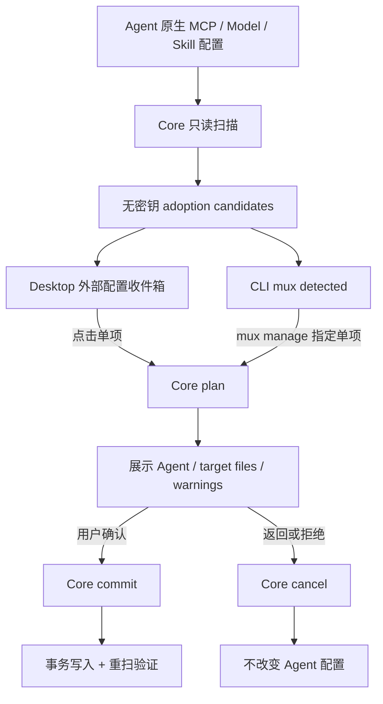

# MUX App / CLI 外部配置识别与纳管能力对齐

## 1. 结论

这次对齐的核心不是让 Desktop 和 CLI 长得一样，而是让它们遵守同一条所有权协议：

1. **识别永远只读**：MUX 可以扫描 Agent 中已有的 MCP、Model、Skill，但扫描结果不等于 MUX 已拥有这些配置。
2. **一次只处理一个候选**：没有默认勾选、全选、批量循环提交，也没有“刷新即导入”。
3. **写入必须经过同一个 Core plan / commit / cancel 边界**：前端只能选择候选、展示计划并让用户确认，不能自行拼接写文件。
4. **MCP、Model、Skill 的领域覆盖一致**：Desktop 的外部配置收件箱和 CLI 的 `detected` / `manage` 都覆盖三个领域。

Desktop 仍然是中央 Model / Skill 的富编辑器，兼容 TUI 的目录编辑仍以 MCP 为主；这是呈现层差异，不再改变“外部配置是否被 MUX 接管”的语义。

## 2. 修改前的问题

### 2.1 Desktop 实际是批量写入器

旧 `MigrationDialog` 会把全部安全候选默认放入 `selected`，底部按钮显示“导入 N 项”，点击后依次为 MCP、Model、Skill 调 plan 并立即 commit。也就是说，界面虽然展示了候选列表，真正的用户决策粒度仍是整个集合。

候选本身由前端按稳定资产身份聚合：

- Model 按外部配置 fingerprint 聚合；
- MCP 按 `name::transport` 资产 key 聚合；
- Skill 按名称聚合相同内容的 Agent 目录。

聚合和冲突判定仍保留在 [desktop/src/lib/migration.ts](../desktop/src/lib/migration.ts#L52-L203)，因为“一项”指一个可被中央资产模型安全表达的逻辑资产，而不是盲目复制一个文件。

### 2.2 CLI 的 `mux import` 只覆盖 MCP，且会批量提交

旧命令先扫描所有 MCP observation，再按资产 key 分组并循环 plan + commit。它有三个问题：

- 命令名是通用的 `import`，实际只支持 MCP；
- 不提供 Model / Skill 对等能力；
- 不展示逐项影响，也没有逐项确认。

兼容 TUI 还有另一条隐式批量路径：刷新 managed `discovered` source 会触发 `ImportDiscovered`，把扫描和接管混成一个动作。

### 2.3 Core 其实早已具备统一能力

问题不在 Core。统一请求枚举已经同时包含 `AdoptMcp`、`AdoptModel`、`AdoptSkill`，以及三个领域的其它生命周期操作，见 [core/src/application/operations.rs](../core/src/application/operations.rs#L21-L47)。同一模块把它们投影成统一的 `OperationPlan`，并提供同一个 commit / cancel 入口，见 [core/src/application/operations.rs](../core/src/application/operations.rs#L49-L80) 和 [core/src/application/operations.rs](../core/src/application/operations.rs#L196-L220)。

因此正确修复是删除前端批量编排，让 App 和 CLI 都回到 Core 的单项事务边界，而不是再造一套导入引擎。

## 3. 对齐后的能力矩阵

| 能力 | Desktop App | CLI | 一致性约束 |
|---|---|---|---|
| 扫描 MCP 外部配置 | 启动后延迟扫描、手动重扫 | `mux detected` | 只读、无密钥 DTO |
| 扫描 Model 外部配置 | 启动后延迟扫描、手动重扫 | `mux detected` | 只读，credential 只暴露类别/引用 |
| 扫描 Skill 外部配置 | 延迟做内容 hash / risk audit | `mux detected` | 只显示 Agent target 的 `external` 项 |
| 纳管一个 MCP | 每项“让 MUX 管理” | `mux manage mcp <key> --agent <id>` | plan → review → confirm → commit |
| 纳管一个 Model | 每项“让 MUX 管理” | `mux manage model <candidate-id>` | plan → review → confirm → commit |
| 纳管一个 Skill | 每项“让 MUX 管理” | `mux manage skill <identity>` | plan → risk gate → review → confirm → commit |
| 批量接管 Agent 配置 | 已删除 | 已删除 | 不允许 |
| 重新扫描 | 更新只读候选 | `mux detected` / TUI source refresh | 不产生 ownership |
| 中央 MCP 编辑 | 完整 UI | 兼容命令 / TUI | 共享 Core，但交互形态不同 |
| 中央 Model / Skill 富编辑 | 完整 UI | 列表、workspace、外部单项纳管 | 仍是已知的呈现层差异 |

最后两行不是外部配置所有权语义的一部分。本次没有用一个脆弱的通用 JSON 写入口假装 CLI 已拥有完整富编辑体验；相关新增能力应继续通过 typed Core operation 单独设计。

## 4. 运行时调用链

### 4.1 Desktop

启动仍把三类 migration scan 放在 deferred tasks 中，避免阻塞第一屏；它们与 Registry、Agent、Skills 等新鲜数据读取相互独立，见 [desktop/src/App.tsx](../desktop/src/App.tsx#L93-L147)。

候选入口只显示“识别”语义，明确说明 MUX 不会自动导入，见 [desktop/src/components/MigrationBanner.tsx](../desktop/src/components/MigrationBanner.tsx#L22-L45)。列表已删除 checkbox、domain 全选和底部“导入 N 项”；每行只有独立按钮，见 [desktop/src/components/MigrationDialog.tsx](../desktop/src/components/MigrationDialog.tsx#L179-L259)。

点击单项后：

1. 只为该候选调用对应 `adopt_*` plan，见 [desktop/src/components/MigrationDialog.tsx](../desktop/src/components/MigrationDialog.tsx#L262-L292)；
2. 切换到单项影响审查，展示 Agent、目标位置和 warning，见 [desktop/src/components/MigrationDialog.tsx](../desktop/src/components/MigrationDialog.tsx#L130-L176)；
3. 用户再次确认后才 commit；返回、关闭或风险状态变化都会 cancel，见 [desktop/src/components/MigrationDialog.tsx](../desktop/src/components/MigrationDialog.tsx#L42-L128) 和 [desktop/src/components/MigrationDialog.tsx](../desktop/src/components/MigrationDialog.tsx#L294-L320)。

### 4.2 CLI

CLI 顶层命令现在明确区分：

- `detected`：三个领域的无副作用扫描；
- `manage`：指定一个精确候选。

命令契约见 [cli/src/main.rs](../cli/src/main.rs#L79-L159)，路由见 [cli/src/main.rs](../cli/src/main.rs#L185-L203)。

`cmd_detected` 分别读取 MCP、Model 和 Skill 候选；Skill 会过滤为 Agent target 的 `external` observation，避免把中央 Skill 错报为待接管项，见 [cli/src/main.rs](../cli/src/main.rs#L306-L398)。

`cmd_manage` 会重新读取候选并用 candidate id / fingerprint 绑定当前观测，防止用户拿旧列表覆盖新配置，见 [cli/src/main.rs](../cli/src/main.rs#L443-L500)；然后打印 plan 的 Agent、目标文件和 warning，最后要求 `y/yes` 确认，见 [cli/src/main.rs](../cli/src/main.rs#L502-L561)。不可提交、需要冲突确认或高风险审查的计划会先 cancel，不会进入确认提示；其余计划确认后仍通过统一 Core commit，见 [cli/src/main.rs](../cli/src/main.rs#L400-L441) 和 [cli/src/main.rs](../cli/src/main.rs#L563-L596)。

### 4.3 TUI

TUI 的 discovered source 刷新现在只返回 `LoadAll`，状态文案明确为“未自动导入”，见 [cli/src/tui/update.rs](../cli/src/tui/update.rs#L416-L430)。原 `ImportDiscovered` effect 和批量 adoption 函数已经删除。

### 4.4 多语言呈现边界

候选详情不再先拼接中文字符串后交给 DOM 翻译桥猜测，而是由
`MigrationCandidateDetail` 的 Model / MCP / Skill 判别联合保存 provider、transport、
Agent 数量、目录数量和状态等结构化值；已知冲突也使用 `MigrationConflict` 枚举。
Desktop 在渲染边界通过类型化 i18n 生成中文或英文。Core 已知的 Model credential /
provider 冲突会先映射为稳定枚举；未知动态错误仍保留原始内容，显示时优先做兼容翻译，
英文环境无法安全翻译时退化为准确的通用修复提示，不改变候选 identity 或 plan 输入。

这也修复了 Portal 弹窗位于 `#root` 之外、无法被旧 `LegacyLocalizationBridge` 观察的问题：
Banner 与 Dialog 现在都直接订阅当前语言，切换语言后包括动态计数、候选详情、冲突原因、
审查字段和操作状态在内会一起更新。

## 5. 被删除与被保留的行为

### 已删除

- Desktop 默认选中全部安全候选；
- Desktop checkbox、按领域全选/取消全选；
- Desktop “导入 N 项”批量循环；
- CLI `mux import`；
- TUI 刷新 discovered source 时批量接管 MCP；
- 与上述控件绑定的旧多语言文案。

### 有意保留

- 外部候选扫描与冲突识别；
- 相同逻辑资产的安全聚合；
- 启动后延迟扫描和手动重新扫描；
- 用户主动粘贴 MCP 配置、订阅来源、导入本地来源；
- 用户主动从 GitHub / 本地安装新的中央 Skill。

后两类是用户明确提供一个中央资产来源，不是“扫描 Agent 后自动夺取所有权”，因此不属于应删除的批量接管路径。

## 6. 回归门禁

Desktop 测试现在直接证明：

- 页面不存在 checkbox、全选或“导入 N 项”；
- MCP、Model、Skill 必须逐项点击；
- 第一次点击只产生 plan，不产生 commit；
- 第二次确认才 commit；
- 高风险 Skill 会 cancel，不会写入。
- Portal 弹窗在英文环境中不残留中文，包括动态详情和冲突原因。

对应断言见 [desktop/src/components/MigrationDialog.test.tsx](../desktop/src/components/MigrationDialog.test.tsx#L78-L222)。

CLI 单元测试还固定了三个契约：

- `mux import` 无法解析；
- `mux detected --json` 可用；
- `mux manage` 缺少精确候选参数时无法解析。

这样以后即使新增第四种资源，也必须显式接入 detection / single-item management，而不能重新引入“扫到什么就全部写入”的捷径。
