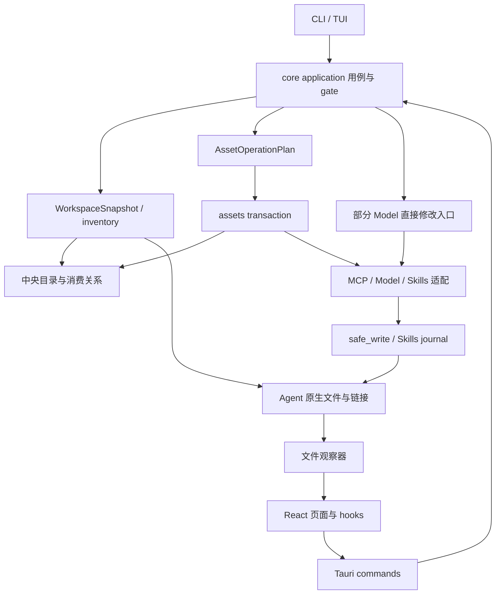
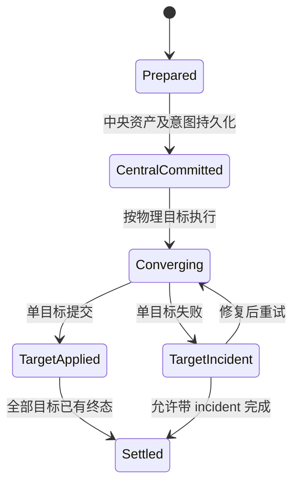

# MUX 架构与缺陷审计

审计日期：2026-09-06。源码基线：v1.8.172，`f6c65d508eca24b48e7e5be842e0d13e97616fc7`。

后续修复说明见 [架构审计修复记录](../docs/architecture-audit-fixes.md)。本文保留 v1.8.172 的审计事实，源码行号对应该基线。

## 结论

MUX 适合继续采用 Rust 模块化单体架构。中央资产、消费关系、原生配置投影、带审阅凭证的操作计划，以及安全写入底层已经形成可用基础。当前最需要解决的是：**不同操作入口没有共享同一套状态语义，逻辑 Agent 与物理配置文件的关系没有贯穿计划、写入、恢复和观察流程。**

本次沿实际调用链识别出 8 组缺陷，其中 4 组优先级为 P1；另有一处重要的崩溃恢复语义与架构契约不一致。它们不是单纯的“大文件”或代码风格问题：具体后果包括切换了不该切换的当前模型、失败后留下已经改写的配置、恢复 Qoder 事务失败，以及移除一个 Agent 的 MCP 影响另一个 Agent。

### 证据边界

- 本报告是静态源码审计：追踪调用者、领域类型、写入实现、失败分支、观察与 UI 刷新链路，并阅读相关测试源码；**没有执行故障注入、测试、构建或真实 Agent 推理**。
- “确认”指可由已读代码及给定前置条件推导的分支行为，不表示已在用户机器触发。每项都给出触发场景与后续验证方法。
- 按当前仓库 `AGENTS.md:24` 的极速模式，本任务未运行测试与检查流水线。没有读取或修改真实用户凭据、Agent 配置，也没有修复、提交或发布产品代码。
- P1：配置正确性、跨 Agent 影响或恢复能力问题，建议优先修复；P2：功能可用性、观察一致性或有条件的阻塞问题。没有证据支持将本次问题标为 P0。

## 1. 实际架构



### 1.1 分层与职责

| 层 | 当前职责 | 关键源码 |
|---|---|---|
| 前端与宿主 | React 交互；Tauri 调用；CLI/TUI 命令适配 | `desktop/src/App.tsx`、`desktop/src-tauri/src/commands.rs`、`cli/src/` |
| Application | bootstrap、读快照、plan/commit/cancel、写入准入 | `core/src/application/mod.rs`、`operations.rs`、`gate.rs` |
| Domain | AssetRef、消费选择、当前模型、incident 等类型 | `core/src/domain/assets.rs` |
| Assets | 生命周期计划、候选哈希、状态前置条件、提交与恢复 | `core/src/assets/planner.rs`、`transaction.rs`、`store.rs` |
| Resources | 各领域扫描、模型协议与凭据投递、MCP codec、Skills 链接 | `core/src/resources/` |
| Persistence | 聚合 Settings、分目录资产存储、CAS、备份、写入证据 | `core/src/settings.rs`、`paths.rs`、`safe_write.rs` |

`core/src/lib.rs` 仍暴露旧的模块别名，Application 包装层与旧资源 API 并存。问题不在于别名本身，而在于调用一个 Application 方法并不必然意味着它经过了统一的操作计划与事务：凭据策略修改就是可见例子。

### 1.2 数据已分库存储，运行时仍聚合读取

| 持久化位置 | 含义 |
|---|---|
| `~/.mux/assets/mcps/catalog.json` | MCP 中央目录 |
| `~/.mux/assets/models/catalog.json` | Provider 与 Model Profile |
| `~/.mux/assets/skills/catalog.json` | Skills 中央目录 |
| `~/.mux/assets/skills/items/` | Skills 中央内容 |
| `~/.mux/settings.json` | 消费关系、Agent 路径与偏好等 |
| Agent 原生配置 | 中央 desired state 的实际投影，也包含外部管理内容 |

依据：`core/src/paths.rs:23`、`core/src/settings.rs:550`。`save_with_expected` 按内容是否变化决定哪些文件需要写入（`settings.rs:625`），所以“资产改了，总会顺便改变 settings.json”这个假设已经不成立。

模型领域已经把“已添加 / 已启用 / 当前模型”分开建模：`core/src/settings.rs:291` 的 `model_selection` 从消费记录与 `model_assignments` 合成视图。这是正确的领域拆分，但下游凭据修改路径没有保持它。

### 1.3 值得保留的基础

1. **计划与提交分离。** 计划绑定操作 ID、候选内容与状态前置条件，避免 UI 展示一种操作、后端实际提交另一种操作。计划加载也校验 schema 与内容哈希（`core/src/assets/planner.rs:3251`）。
2. **区分中央意图与扫描事实。** 消费关系与 observed inventory 分开，能表达外部配置、偏离与目标 incident，而不是把磁盘扫描结果直接变成中央资产。
3. **安全写入底层相对完整。** `core/src/safe_write.rs:3769` 的原地改写路径校验文件身份、父目录与预期内容，结合 mutation intent 和恢复证据。已有文件保留 inode 是明确的宿主兼容约束，不宜随意换成统一 rename。
4. **已有一致快照入口。** `core/src/application/workspace.rs:97` 提供带 revision 的聚合快照，能够成为前端统一读模型的基础；但应先补齐页面所需的 Provider 等 DTO，不能直接删除现有查询。

## 2. 缺陷总表

| 编号 | 优先级 | 缺陷 | 用户可见后果 |
|---|---|---|---|
| B1 | P1 | Qoder 私密事务恢复仍只接受 Claude Desktop | 崩溃后拒绝恢复或清理，留下目标 incident |
| B2 | P1 | 凭据投递修改复用“设为当前模型” | 多模型 Agent 的当前模型被意外切换 |
| B3 | P1 | 凭据批量修改失败只回退中央策略 | 原生配置已部分改变，返回失败后状态仍不一致 |
| B4 | P1 | MCP 没有处理 Qoder CLI/Desktop 共享物理目标 | 移除 Desktop 消费会删除 CLI 仍需要的 MCP |
| B5 | P2 | 模型发现只读取 MUX 凭据存储 | Env/File/Helper 配置有效，加载模型列表仍缺凭据 |
| B6 | P2 | 中央监听路径与模型页面缓存同时遗漏 | CLI 或外部修改后，桌面模型信息持续过期 |
| B7 | P2 | 网络模型发现持有全局读锁 | 慢 Provider 请求阻塞同进程内无关写入 |
| B8 | P2 | watcher 只等待静默期，没有最长聚合期限 | 持续事件导致刷新饥饿，事件数组不断增长 |

## 3. 缺陷调用链与修复方向

### B1：Qoder 事务能够创建私密快照，却不能正常恢复

**证据。** `core/src/assets/transaction.rs:327` 的 `private_transaction_paths` 已把 `~/.qoder/settings.json` 以及 Desktop 模型自定义路径加入私密集合。由于 MCP 与 Models 共用文件，即使操作只修改 MCP，也会使用这类快照。

但同文件 `:765` 的恢复校验仍要求私密集合非空时，`affected_agent_ids` 必须包含 `claude-desktop`：

```rust
// core/src/assets/transaction.rs:767
|| (!private_paths.is_empty()
    && !persisted
        .plan
        .affected_agent_ids
        .iter()
        .any(|agent_id| agent_id == "claude-desktop"))
```

**触发。** 一个仅涉及 Qoder 的操作已经持久化回滚 manifest，在清理前进程退出。重启读取该操作时，这个判断失败。它还位于 commit marker 检查之前（`:791`），因此“操作已提交，只差清理”的窗口也受影响。

**影响边界。** 这是恢复校验的错误拒绝；不等于已经证明用户文件损坏，也不应泛称整个应用永久不可写。恢复循环会保留证据并记录目标 incident（`:689`），后续自动恢复会暂停处理已有 incident 的操作（`:685`）。

**归因。** 这是上一轮 Qoder 接入遗漏的恢复分支：正常写入支持与恢复支持没有一起完成。

**修复。** 短期补齐 Qoder 私密目标的合法性校验与恢复支持；长期由统一的物理目标描述提供 privacy、允许的作用域与恢复策略，避免写入和恢复各自维护 Agent 白名单。不能简单删除 manifest 与 reviewed target 的一致性校验。

### B2：改凭据策略会改变当前模型

**调用链。** `core/src/resources/model/mod.rs:3734` 的 `set_agent_credential_delivery` 修改消费策略后，在 `:3770` 遍历每个 enabled Profile，调用 `apply_profile`。

`apply_profile`（`:3685`）转到 `apply_profile_target`；后者传入的 `active` 恒为 `true`（`:3808`）。对于支持全局当前模型的 Agent，随后写入原生默认模型，并更新中央 `model_assignments`（`:3964`）。例如 Pi 的 `apply_pi` 在 active 分支写默认模型设置（`:5577`）。

**触发。** Pi 或其他支持多模型及全局默认选择的 Agent 已启用 A、B，当前为 A。改变 Agent 凭据投递方式，两次 apply 都按“设为当前模型”执行，最终当前模型成为迭代最后一个 Profile。记录是 `BTreeMap`，结果由 Profile ID 排序决定，与用户的选择无关。

单 Profile 入口也有类似问题：`set_model_credential_delivery` 只判断消费记录存在（`:3701`），没有要求 enabled，再调用相同 apply 路径（`:3717`）。因此改一个非当前甚至停用 Profile 的策略，可能把它写回并设为当前。

**边界。** Qoder Desktop 被 `supports_global_model_selection` 保护（`:3836`），不受这个“全局当前模型”分支影响；不能把所有 Agent 都列为受影响。

**修复。** 把“改凭据投影”与“安装/启用/选择模型”拆成不同意图。策略更新必须保留原有 active 和 enabled；停用 Profile 只更新策略，不执行启用写入。

### B3：凭据修改中途失败，原生文件没有跟随回退

**证据。** `core/src/resources/model/mod.rs:3774` 按 Profile 逐个写入。某个 Profile 失败后，`:3781` 只恢复 `settings.set_model_selection(agent_id, before)`，没有恢复前面 Profile 已改写的 Agent 文件。这条直接修改路径没有包裹整个操作的资产事务。

**触发。** 同一多模型 Agent 的 A 写入成功，B 在凭据解析或原生写入阶段失败。函数返回错误，中央消费策略恢复旧值，A 的原生投影仍是新值。是否切换了当前模型还可能叠加 B2。

更敏感的具体场景是：从引用凭据改成明文投递，A 凭据可解析，B 的文件或环境变量不可用；A 已被写成明文，但失败分支恢复的是旧投递策略。界面可能显示旧策略，磁盘却保留新的投递方式。这里是已确认写入的状态未撤回，不是在未授权情况下凭空外发凭据。

**修复。** 将凭据策略纳入 operation plan。先解析/准备全部必要输入，再按最小物理 write set 一次提交。失败语义必须一致：同一目标内安全回退；跨目标保留已提交 desired 与成功目标、为失败目标记录 incident。不能继续采用“只撤中央记录”的混合语义。

### B4：两个 Qoder 产品共享文件，MCP 操作却只考虑一个 Agent

**证据链。**

1. `data/agents.json:42` 与 `:43`：Qoder Desktop / CLI 都使用 `~/.qoder/settings.json` 的 `mcpServers`。
2. `core/src/assets/planner.rs:216`：单 Agent MCP 消费计划的 before/after 只有传入 Agent。
3. `core/src/assets/transaction.rs:2555`：删除差集只对该 Agent 调用 `ops::delete`。
4. `core/src/resources/mcp/ops.rs:964`、`:153`：构造单 Agent 的 Remove diff，删除对应文件条目，没有查询同一物理目标的其他消费者。
5. 收敛验证在 `core/src/assets/transaction.rs:2642` 只筛选本次 Agent。

**触发。** CLI 和 Desktop 都声明消费中央 MCP S，原生文件中 S 存在。在 Desktop 解除 S 的消费。MUX 删除共享文件中的 S，CLI 的中央消费记录仍保留，却已经无法从共享配置读取 S。

**修复。** 引入物理目标身份，计算所有受影响消费者。两个产品共用同一个 key 时，UI 应表达“共享配置”，并采用共享消费集合或在计划中显式处理联动。不能继续承诺物理上不可能实现的完全独立开关。Skills 已有消费者闭包检查（`core/src/assets/planner.rs:1866`），可以复用其思想，但 MCP 需要字段级所有权，不宜照搬目录链接实现。

### B5：模型目录发现忽略已配置的凭据来源

**证据。** `core/src/resources/model/discovery.rs:64` 固定调用 `read_credential(provider_credential_subject(provider_id))`，没有按 Provider 的 `api_key_source` 解析。`:73` 随即按目录适配器要求判断是否缺少凭据。

资源层其实已有统一解析能力：`core/src/resources/model/credential.rs:256` 支持 MuxStore、Env、File、Helper。目录发现没有接入它。另一方面，内置 provider 的 discovery spec 在 `discovery.rs:182` 直接返回，没有结合实例的 `auth_requirement`。

**触发。** 一个要求认证的 Provider 已正确配置 Env/File/Helper，MUX Keychain 中没有其 API Key。模型投递可以使用该来源，但点击“加载模型列表”会直接报缺凭据；对可选认证的适配器则可能发送未认证请求。

**修复。** 统一 Provider 凭据解析与认证策略。目录发现应使用实例声明的来源；认证是否必需应明确区分实例设置与特定目录接口要求，不能仅由 provider 名称决定。避免让用户为了同一 Provider 重复把密钥存进另一来源。

### B6：观察事件缺失与页面缓存缺失是两个独立问题

**后台缺口。** `core/src/assets/observation.rs:27` 监听中央 `settings.json`，以及旧 `~/.mux/skills` 和 Agent 配置路径，却没有列出三个新的中央 catalog 与 `assets/skills/items`。`settings.rs:625` 会跳过内容不变的文件，因此只修改一个未分配 Provider 的名称时，不一定有任何被关注的 Agent 文件或 settings 写入。

**前端缺口。** 即使另一个事件成功触发全局刷新，`desktop/src/App.tsx:157` 的 observation tasks 也没有刷新 Model Profiles、Provider instances 或 AgentView 的本地模型数据。`ModelsView.tsx:335` 自己持有三组查询结果，`:352` 的 effect 依赖中没有 observation revision；`AgentView.tsx:215` 的模型数据同样由自己的刷新函数管理。App 渲染没有用版本 key 使这些页面重挂载（`App.tsx:267`）。

**触发。** 保持 Models 页面打开，从 CLI 更新中央 Provider 或 Profile。页面可能收不到事件；即便点击全局重扫或窗口重新聚焦刷新，页面私有模型缓存也没有对应的重新查询。离开再进入或本页面的某些操作可以碰巧刷新，不能视为链路正确。

**修复。** 第一层从真正的中央路径生成观察目标；第二层让所有模型页面订阅统一、带 revision 的读缓存。两层都要修，不能只补一个 watcher 路径。快照入口需按页面需要扩充，刷新按领域合并并丢弃过期响应，避免每次文件事件都全量重扫。

### B7：慢网络请求阻塞无关写入

**证据链。** `core/src/application/models.rs:23` 在 `gate::read` 闭包中执行整个 `discover_provider_models`。`core/src/application/gate.rs:52` 的读锁直到闭包返回才释放，所有 `mutate_scoped` 则需要同一个 gate 的写锁（`:131`）。

目录发现是同步分页网络请求（`core/src/resources/model/discovery.rs:82`），最多 10 页，每次请求配置 15 秒全局超时（`:478`）。这些是代码配置值，不是本次耗时测量；整个目录操作没有单独的总时间预算。

**触发。** 在 Desktop 中加载一个慢 Provider 的模型列表，同时修改无关 MCP 或偏好。后台线程执行网络请求并不能释放 Core 的读锁，因此后一个操作仍可能等待请求结束。这描述的是同进程 gate 的阻塞，不推断所有其他 CLI 进程也被这把读锁锁住。

**修复。** 在短读锁中复制不可变查询输入，然后释放锁再做外部 I/O；结果带上 Provider/revision 身份，必要时拒绝过期结果。增加整次请求 deadline 和取消能力。不要先大改锁体系来掩盖这个可直接缩小的临界区。

### B8：持续事件可让 watcher 永不刷新

**证据。** `desktop/src-tauri/src/observation_watcher.rs:37` 收到首个事件后，循环 `recv_timeout(250ms)` 并追加到 Vec；只有出现 250ms 静默期后才执行过滤与 emit。没有 max-wait、事件数量上限或去重。Access 事件在 `:82` 才过滤，已参与前面的延时与累积。

**触发条件。** 底层持续投递间隔小于 250ms 的事件时，循环无法退出，真正相关的变更也无法送达 UI，Vec 持续增长。监控不存在目标的最近祖先目录会扩大可能收到的事件面。具体机器上的发生频率尚未测量。

**修复。** 收到事件立即过滤无关类型，按目标/领域合并；使用静默时间与最长等待时间双条件，最长窗口到达时必须刷新。保留有界集合，避免保存全部原始事件。

## 4. 一处更深的架构契约偏差：目标独立收敛尚未覆盖崩溃恢复

`AGENTS.md:17` 明确要求中央 desired 先持久化，每个目标独立收敛，不回滚已经成功的其他目标。

当前普通目标写入失败时，`apply_mcp` 等路径已经会记录局部 incident 并继续，方向正确。但外层事务仍有一个覆盖中央 settings、三个 catalog 与所有目标的回滚 manifest（`core/src/assets/transaction.rs:414`），全局 commit marker 要等 apply/verify 后才写（`:510`）。恢复代码明确说明“没有 commit marker 的操作整体回滚”（`:820`），并在 `:852` 恢复整个快照集合。

**可推导场景：** 一次 Provider 更新影响 A、B，中央目录与 A 已写入，进程在 B 完成前退出。只要写入所有权证据仍匹配，恢复会把中央与 A 一起回退。这里没有宣称用户已经收到最终成功提示；问题是目标级持久化承诺没有在崩溃路径实现。

建议将持久化边界改成：



每个物理目标仍需要自己的 CAS、私密快照和写入 journal；中央提交后，恢复以继续收敛为主。不要用删除备份、忽略失败或无条件重写文件来模拟“独立收敛”。这项应单独设计和迁移，不能与 B1 的局部修复混在一个大补丁里。

## 5. 优化建议与实施顺序

### 第一阶段：先修用户可见的正确性问题

1. 修 B1，覆盖 Qoder Model、MCP、提交后清理三种窗口；这是新功能接入缺口，变更范围可控制。
2. 同时修 B2/B3：凭据策略修改成为明确操作意图，保留模型选择状态，按物理文件完成一致写入。
3. 修 B4：为 Qoder 共享 MCP 目标明确消费语义，审阅计划显示全部受影响产品。
4. 修 B5/B6，并缩短 B7 临界区、限制 B8 的聚合窗口。这些可以按领域独立落地。

### 第二阶段：把扩展契约集中起来

建议新增一个 Core 内部的目标描述契约，以下为设计草案，不是已有 API：

```rust
struct TargetSpec {
    id: PhysicalTargetId,
    consumers: Vec<AgentCapabilityRef>,
    owned_fields: FieldOwnership,
    privacy: PrivacyPolicy,
    recovery: RecoveryPolicy,
    observation: ObservationSpec,
}
```

它回答“哪个物理目标、哪些消费者、各写哪些字段、如何保护与恢复、观察哪些依赖”。Model adapter 再声明支持的协议、是否支持全局当前模型、允许的凭据投递方式。计划、写入、恢复与扫描使用同一份描述，解决 B1/B4/B6 反映的重复登记问题。

物理目标归一化也需要尊重安全写入中的 symlink/父目录约束，不能只对路径字符串去重或盲目 canonicalize。共享文件的 MCP 与 Models 可以有不同字段所有权，但备份与恢复冲突必须在文件层协调。

### 第三阶段：完成提交语义与读模型收敛

- **事务：** 将中央提交与目标 journal 拆开，明确“已保存、同步中、部分失败、已收敛”的结果类型。目标 incident 与物理 write set 绑定。
- **前端：** 把页面私有的核心实体缓存迁到一个 revision 驱动的读模型；表单草稿、搜索与展开状态仍由页面管理。不要用频繁重挂载页面替代数据刷新。
- **并发：** 先把网络、helper 和慢扫描从全局临界区移出，再按测量结果决定是否需要能力级/目标级锁。当前全局 gate 与提交时多个全局锁相叠加，直接加并发线程不会解决串行化。
- **代码边界：** 按“凭据来源解析、投递准备、目标渲染、观察解析、生命周期编排”拆 Model 大模块，而非只按行数拆文件。入口返回结构化错误与收敛状态，减少依赖字符串前缀判定恢复需求。

### 暂不建议优先做的事

没有现有证据支持先迁移数据库、拆微服务或重写桌面框架。这些不能自动修复共享文件所有权、错误的 active 语义或失败回退。JSON 分库存储可以继续使用，先修真实消费者与持久化契约。

同样，安全写入代码复杂有其原因。已有文件原地写会给外部读者留下短暂中间状态窗口；MUX 的锁也不能强制外部 Agent 合作。这属于需要按 Agent 行为验证的设计取舍，本次没有把它虚构成已复现的文件损坏 bug。

## 6. 后续验证矩阵（本次未执行）

所有自动化用临时 HOME/MUX_HOME、假凭据存储与本地假服务，避免真实配置和 Keychain。

| 场景 | 应满足的性质 |
|---|---|
| Qoder Model/MCP 在 manifest 后退出 | 下次启动能按证据恢复，无错误的 Claude 专属限制 |
| Qoder 在 commit marker 后、清理前退出 | 只完成清理，不回退已提交内容 |
| A/B 已启用、A 当前，修改凭据策略 | enabled 与 active 全部保持；只有投递方式改变 |
| 修改停用 B 的凭据策略 | 不重新安装或启用 B，不切换当前模型 |
| A 准备成功、B 凭据解析失败 | 同一物理目标不留下部分改写，中央状态准确 |
| CLI/Desktop 共用 MCP S，解除其中一个消费 | 执行已明确的共享语义，不悄悄破坏另一消费者 |
| 仅 Env/File/Helper 有凭据 | 目录请求使用指定来源，不错误要求 Keychain 副本 |
| CLI 只改未分配 Provider/Model 目录 | 打开的 Models 页面最终展示最新版本 |
| 修改中央 Skills 内容 | 新 canonical 路径能触发观察刷新 |
| 模拟慢目录接口，同时修改无关偏好 | 无关写入不被目录网络请求的读锁阻塞 |
| 持续事件流没有 250ms 静默期 | 最长窗口到达仍刷新，内存占用有界 |
| 中央与 A 提交、B 前退出 | 按新目标级契约保留中央/A，并恢复 B 的收敛任务 |

## 7. 阅读范围与规模说明

本次重点阅读了 Application gate/operations/workspace/models、Assets planner/transaction/observation、Settings/Paths、Model credential/discovery/原生写入、MCP 消费删除链路、Skills journal 与消费者闭包、Desktop 启动刷新/页面缓存/文件观察器。没有声称逐行审完全部发布脚本和每一个 Agent codec。

源码文本统计：Core 78 个 Rust 文件约 78,547 行，CLI 17 个 Rust 文件约 7,431 行；Desktop 前端 141 个 TS/TSX 文件约 29,955 行，Tauri 源码 6 个 Rust 文件约 1,709 行。数字包含注释与测试，不能直接当作生产逻辑体量或缺陷密度。

例如 `resources/model/mod.rs` 共 7,749 行，主内联测试模块从约 5,695 行开始；`assets/transaction.rs` 共 6,454 行，主测试模块约从 4,295 行开始。它们确实增加跨功能理解成本，但本报告的优化建议依据是实际状态契约和调用链缺陷，而非文件长度排名。
