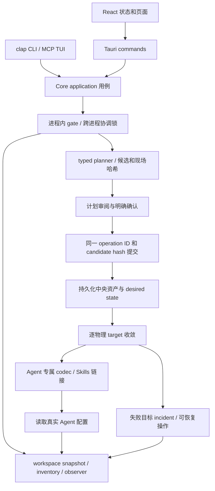

# MUX 代码审计、CLI / Desktop 能力对照与本次优化

审计基线：`v1.8.192` / `d8186909c9accf431d5dd2487c64e102c37730c5`，2026-09-12 拉取后与 `origin/main` 一致。本报告以当前源码为依据；历史报告中的命令名不代表现在仍存在的入口。

结论：两端共用 Core，但基线版本的功能入口没有同步。CLI 已能查询、分配和收敛 MCP / Model / Skill，却不能独立完成 Model / Provider / Skill 的中央生命周期。本次补齐主要资源管理入口，并修复调用边界与结果处理问题。静态分析和生产编译不能证明所有故障分支都正确；按当前仓库快速模式，未运行测试套件。

## 1. 架构与真实调用链

关键边界：

| 层 | 职责 | 依据 |
|---|---|---|
| `application::MuxCore` | bootstrap / snapshot / plan / commit / cancel 的公共门面 | [`mod.rs`](../core/src/application/mod.rs#L25) |
| `application::operations` | 将稳定的 typed request 分派给资产或 Skill 用例 | [`operations.rs`](../core/src/application/operations.rs#L21) |
| `application::gate` | 区分共享只读恢复、能力域故障、独立偏好写入 | [`gate.rs`](../core/src/application/gate.rs#L123) |
| `application::workspace` | 对 MUX 协作写进程加共享锁；外部 Agent 文件只作为某一时点的观测 | [`workspace.rs`](../core/src/application/workspace.rs#L100) |
| `assets::planner / transaction` | 绑定候选、目标现场和消费关系；持久化、逐目标写入、恢复 | [`planner.rs`](../core/src/assets/planner.rs#L2094)、[`transaction.rs`](../core/src/assets/transaction.rs#L483) |
| `resources::model / mcp / skill` | 各域格式、原生配置、来源解析、中央目录和链接 | [`resources/`](../core/src/resources/) |
| CLI / Tauri | 参数与界面适配、脱敏、确认、结果呈现 | [`review.rs`](../cli/src/review.rs#L52)、[`commands.rs`](../desktop/src-tauri/src/commands.rs#L134) |

共用 Core 的价值已经体现：本次 CLI 新增入口无需再写 Qoder、Codex 等 Agent 的配置文件逻辑，也无需复制 Skill 下载、风险扫描、链接和 CAS 实现。Provider 保存会沿用同一条中央事务和相关 Model 投影链路。

但“入口共用”不等于“能力覆盖一致”，也不保证前端正确处理 Core 的每种结果。此次问题主要发生在这两处。

## 2. 已确认的问题与修复

### P1：能力域故障隔离在凭据入口失效

触发条件：后端被标记为 MCP 或 Skill 局部不可用，此时修改 Agent 的 Model 凭据交付方式。

基线 `application::models::{set_credential_delivery,set_agent_credential_delivery}` 使用共享 `gate::write`。共享 scope 在任一能力域 unavailable 时被拒绝，因此无关故障会连带阻止模型凭据操作。

修复：两个写入口统一使用 Model scope；新增 `plan_credential_delivery`，让 CLI 可以先审阅再通过统一事务提交。共享恢复只读边界仍由 gate 执行。新增回归用例覆盖 MCP / Skill 故障下的三个 Model 凭据入口。

依据：[`models.rs`](../core/src/application/models.rs#L49)、[`scope_is_blocked`](../core/src/application/gate.rs#L373)。

### P1：CLI 把普通提交确认提升成 Skill 风险授权

触发条件：Skill 计划的 `requires_risk_override` 为 true，调用普通 `--yes` 或普通交互确认。

基线 CLI 会自动把 `findings_hash` 填入 `findings_confirmation`。Core 明确区分普通确认与风险确认，但 CLI 丢掉了这个区别。

修复：新增独立 `--accept-risk`；`--dry-run` 可查看 findings，普通 `--yes` 不授予风险豁免。最终提交的确认哈希仍来自实际提交的同一个计划，不从用户输入随意拼接。新增回归用例覆盖有风险、明确接受和无风险三个分支。

依据：[`risk_confirmation_error`](../cli/src/review.rs#L233)、[`SkillCommitRequest`](../core/src/resources/skill/types.rs)。

### P1：中央提交成功、目标部分失败时，CLI 丢失恢复上下文

触发条件：Core 返回 `OperationCommitResult::Asset { converged: false, inventory }`。

基线 CLI 将其直接转成普通 error，丢失 inventory 和 operation ID，又进入取消计划的异常分支。Core 会拒绝取消已开始提交或有恢复证据的操作，因此不能据此声称存在回滚数据丢失；确认的问题是取消语义错误，以及脚本无法知道哪些改动已经持久化。

修复：将“Core 提交调用失败”和“Core 已提交但未全部收敛”分开处理。后者保留退出码 1，输出 `pending_convergence`、`changed: true`、`operation_id` 和仅属于本次操作的脱敏 target incidents，且不再走取消分支。

依据：[`execute_operation`](../cli/src/review.rs#L52)、[`commit_output`](../cli/src/review.rs#L270)、[`Core cancel`](../core/src/assets/transaction.rs#L1095)。

### P1：自动管理 MCP 来源缺少 Core 保护

触发条件：直接调用 Core 的来源删除 API，目标是 `manual` 或 `discovered`，且没有消费关系阻止此次来源删除。

Desktop 和 TUI 隐藏或阻止了该操作，Core 原来没有同等 ownership 检查。绕过前端可进入删除来源注册及缓存的逻辑。

修复：在 Core 的来源删除和刷新入口明确拒绝自动管理来源。正常删除单个中央 MCP 仍走资产生命周期。Desktop 的“重新探索”调用独立扫描入口，TUI 同样只重新载入，不受此限制影响。新增回归用例检查两个来源的注册与文件在拒绝操作后保持原样。

依据：[`sources.rs`](../core/src/resources/mcp/sources.rs#L623)、[`SourcesSidebar.tsx`](../desktop/src/components/SourcesSidebar.tsx#L65)、[`TUI sources`](../cli/src/tui/update.rs#L364)。

### P2：计划、回执与能力投影中的遗漏

本次同时修复：

1. `ClearModels` 可以只有外部原生配置写入、没有中央关系变化。旧 CLI 的 no-op 判断不能表示它；新增 CLI 清空入口时一起修复。没有目标或逻辑变化的空计划仍识别为 no-op。
2. `execute_operation` 接收计划后，选项校验失败原来直接返回，不清理已暂存计划。现在进入统一取消流程。
3. 直接 mutation 已经是 no-op 时，JSON 回执把 `dry_run` 固定写成 false。现在保留请求标志。
4. 聚合 Agent 能力缺少 `supports_global_selection`，CLI 还漏掉 `storage_authority`。现已传递这两个事实，避免把 Qoder Desktop 的会话级选择误当成 CLI 的全局选择。
5. 五个仅测试使用的 helper 加入 `cfg(test)`，不再作为无调用生产函数参与构建；没有删除恢复逻辑或测试能力。

依据：[`Core plan semantics`](../core/src/domain/assets.rs#L499)、[`review.rs`](../cli/src/review.rs#L135)、[`CLI capability projection`](../cli/src/projection.rs#L25)、[`Core capability projection`](../core/src/application/agents.rs#L135)。

### 排除的疑点

- **恢复操作是否被 no-op 误判**：MCP / Model / Skill reapply 会生成带说明的 `central_changes`，已有检测能够识别；此次只补实际遗漏的原生清空，不把所有 `target_files` 都一律解释为变化。
- **目标部分失败是否必然丢失中央配置**：Core 已区分中央提交和目标收敛，并保护恢复证据；修复的是 CLI 的结果映射，未据静态猜测重写事务系统。
- **旧报告中的 `adopt` 命令缺失**：历史入口已被统一 `converge` 取代。新的 `model import` 明确表示中央资产导入，不恢复旧命令兼容层。
- **snapshot 是否无条件重复全量读取两次**：当前实现已使用协作读锁和一次投影；不能把旧架构问题直接照搬为当前缺陷。

## 3. CLI 与 Desktop 对照

“已补齐”表示调用相同 Core 用例，不表示界面逐按钮复制或所有批量操作都具备相同交互。

| 能力 | 基线 CLI | 本次 CLI | Desktop / 仍有差异 |
|---|---|---|---|
| 三域中央目录、状态、外部发现 | 有 | 保留 | 共用观测与 inventory |
| 分配、解除、启停、采用/恢复/解除管理 | 有 | 保留 | CLI 关系命令指定单个 Agent |
| 中央 MCP 创建/编辑/删除 | 简单 add/delete，缺少完整编辑 | `mcp save --file`，沿用 typed RegistryEntry | Desktop 另有粘贴配置批量解析 |
| MCP 来源 | 命令缺失，TUI 有 | `mcp source` 八类操作 | 共用来源用例和影响校验 |
| Model Profile 创建/编辑/删除/中央导入 | 缺失 | `model save/delete/import` | 共用中央资产事务 |
| Provider 创建/编辑/删除 | 缺失 | `model provider save/delete` | 共用 Provider 和 Keychain 生命周期 |
| Provider 模板与可用模型查询 | 缺失 | `provider templates/models/list/show` | Desktop 有图形化编辑器 |
| 凭据交付方式 | 缺失 | `model delivery` | 显示或独立验证凭据源仍在 Desktop |
| 原生 Model 全部清空 | 缺失 | `model unassign --all` | 同一个 reviewed clear 用例和共享文件保护 |
| Skill GitHub/目录/压缩包安装 | 缺失 | `inspect-source/install` | 安装项必须显式选择；共同 resolver |
| Skill 外部导入、更新、删除、修复 | 缺失 | `import/update/remove/repair` | 共同来源、风险检查、哈希与链接事务 |
| Skill 更新检查 | 缺失 | `check-updates` | 共同上游检查与本地缓存 |
| 自定义 Agent、能力路径编辑 | 仅启停 | `agent save/configure` | Launch/固定等宿主偏好仍是 Desktop 功能 |
| MUX 网络代理 | 缺失 | `network proxy show/set/clear` | 同一份无明文代理凭据的配置 |
| 一次审阅修改一个资产的多个 Agent 消费者 | 未直接暴露 | 未新增专门批量入口 | Desktop 调用 set/update asset consumers |
| 图标、语言、固定、应用启动、文件对话框 | 无 | 保留桌面边界 | 属于宿主或界面能力 |
| 无参数 TUI | MCP 工作区 | 保留 | 尚未扩展 Model / Skill 页面 |
| Stable 更新 | standalone upgrade / 随 App 内置更新 | 保留 | 两种安装形态有意不同 |

因此不能说两端完全一致。现在主要资源生命周期已经可以独立用 CLI 完成；原子批量消费者操作、部分凭据诊断与宿主交互仍有差异。

## 4. 架构合理性：保留什么、简化什么

| 设计 | 判断 | 具体处理 |
|---|---|---|
| Rust Core + 薄 CLI/Tauri/React | 合理，必须保留 | 配置与状态语义只在 Core；新增命令只做参数适配和呈现 |
| 统一 Operation 外壳，MCP/Model/Skill 内部保持类型差异 | 合理 | 三种资源共享事务流程，但 Model 有 current/凭据，Skill 有目录/风险；不强行做万能 CRUD 或字符串驱动的插件接口 |
| 中央 desired 与物理 target 分离 | 合理且必要 | 某一 Agent 失败不能推翻其他目标；前端必须明确处理“已保存但未收敛” |
| CLI 依据命令名重复判断 Model 故障门禁 | 不合理，容易与 Core 漂移 | 本次删除整套 CLI 特判；包括 Agent 配置命令在内，实际 Core 用例统一判定故障 scope |
| CLI 自行判断计划是否有变化，再由调用方传 `AlwaysChange`/`Detect` | 不合理，属于领域判断且容易遗漏物理清空 | 本次将 `has_changes()` 收入 Core 计划类型，删除 CLI 的 `NoopPolicy` 和重复判断；所有命令调用同一语义 |
| 从 JSON 展示摘要中取回 operation ID | 不合理，类型信息无端丢失 | 使用 typed `OperationPlan::operation_id()`；JSON 只作为输出 |
| 恢复日志、CAS、加密回滚、inode 保留 | 必要复杂度 | 这部分保护真实用户配置，不能为了短代码合并成普通 JSON 全量覆盖 |
| 大型 planner / transaction / model 文件 | 边界有价值，组织需要继续改善 | 先按协议、凭据、投影拆实现与测试文件；保留明确事务边界，不先添加抽象工厂或通用仓储层 |

### 一处仍值得优先改进的锁粒度

`gate::mutate_scoped` 在执行整个闭包期间持有进程级写锁。`application::mcp::sources::{subscribe,refresh}` 和 `application::skills::resolve_source` 在这个闭包中进行来源处理，其中可能包含网络下载；慢网络会延迟其他需要 Core gate 的查询。这是从调用链可确认的串行化成本，没有实测延迟数据，不能量化为性能下降比例。

Model 的 `discover_provider_models` 已有更清晰的范例：先在读锁内准备请求，再在锁外联网。来源操作可演进为“读取并绑定必要输入 → 锁外下载到私有暂存 → 重新入锁检查并发布”。必须明确暂存取消、进程退出恢复、代理配置变动和提交前校验，不能简单删除锁。本次没有在缺少故障注入验证的情况下贸然改变这条并发边界。

代码简洁以职责单一和调用方不重复规则衡量，不以总代码行数减少衡量。新增可用命令需要参数定义；这些定义集中在各 CLI 适配文件中，没有扩张 Agent codec 的业务分支。

## 5. 实现选择与后续优化建议

### 已采用的选择

- 新 CLI 按 Model、Skill、Source、Agent、Network 分文件；不继续把所有新用例堆入旧的 `command.rs`，不增加一个绕过产品语义的通用 JSON RPC 命令。
- 文件输入反序列化为现有领域类型。配置文件限制 1 MiB，凭据 stdin 限制 64 KiB；拒绝两个输入争抢 stdin、空 stdin 意外清除凭据，以及交互终端回显凭据。
- JSON 来源与 Provider 视图显式投影：URL / 私有路径脱敏，Helper 命令和参数不输出，凭据只交给 Core。
- Skill 源解析失败或取消后清理暂存。安装与分配分成两种意图，保持中央资产入口和 Agent 消费入口的职责。
- 所有资产计划沿用 operation ID、candidate hash 和 Core 安全写入；来源注册、Agent 定义与代理偏好使用现有 Core 用例。

### 建议优先级

| 优先级 | 建议 | 原因与验收标准 |
|---|---|---|
| P1 | 把能力覆盖矩阵变成显式维护的契约，在手动验证流程中检查 | 共用 Core 仍曾遗漏生命周期入口；至少核对每个可写用例在两端是否有入口，或标明宿主限定 |
| P1 | 补目标失败、恢复重启、跨进程 CAS 和高风险 Skill 的手动故障注入验证 | 本次生产编译覆盖类型和依赖，不能证明崩溃一致性；必须隔离 HOME / MUX_HOME / Keychain |
| P2 | 缩小网络来源操作持锁时间 | 使用已绑定输入和私有暂存，下载放在全局 gate 外；重新入锁校验后发布，需补并发与中断验证 |
| P2 | 给来源注册、Agent 定义和网络偏好提供可复用的 typed preparation 结果 | 当前 CLI dry-run 对这类操作只展示意图，远程获取和完整写入前校验在提交时执行；不能与资产 planner 的精度等同 |
| P2 | 增加 `asset consumers` 的显式批量 CLI 入口 | 当前一次一个 Agent；脚本循环不能提供 Desktop 多消费者计划的一次性审阅和候选绑定 |
| P2 | 按职责拆分大模块，先分协议 writer、凭据路由、能力元数据，再考虑抽象 | `model/mod.rs` 约 8,000 行、`transaction.rs` 约 6,700 行、`planner.rs` 约 5,000 行，均含测试；要降低修改跨度，不能据行数直接认定性能问题或拆碎事务边界 |
| P3 | 在有终端交互需求时扩展 TUI | 命令模式已经补齐主要生命周期；TUI 不应再实现另一套状态和风险确认逻辑 |

没有测量就不声称性能提升百分比；本次优化重点是功能闭环、故障隔离和可恢复性，而非推测 CPU 或启动速度。

## 6. 验证与范围

生产 CLI 编译通过且无警告；读取了 Model、Skill install、MCP source 的真实命令帮助，核对变更差异、参数定义和现有调用方。新增针对风险授权、目标失败回执、能力域隔离、自动管理来源保护、原生清空、输入边界与参数组合的回归代码；删除的 CLI 门禁白名单测试由真实 Core 用例隔离测试承接，按快速模式未执行测试、fmt、clippy 或质量预检。

未用真实用户密钥、原生模型配置或 Skill 库执行新增写命令。正常交付继续使用 main 自动 patch Stable，发行资产独立复验后安装正式 App；具体发布和安装结果以任务交付记录为准。

使用示例见 [CLI 指南](../website/guide/cli.md)。
