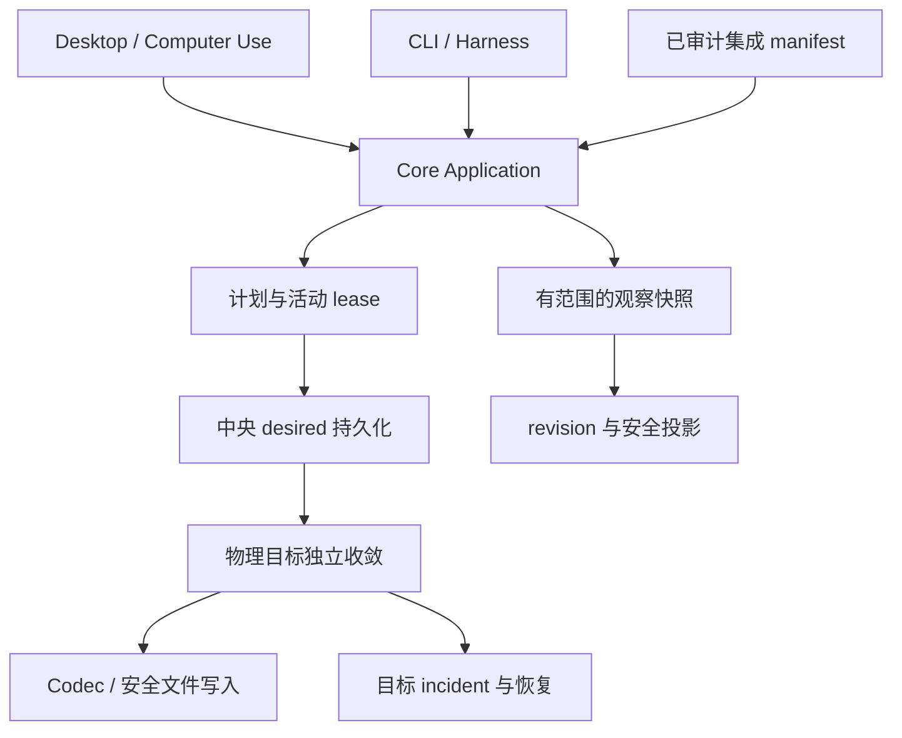

# MUX 优化空间深度调研

调研日期：2026-10-05。源码基线：`main 6ed95b8abd20560dbd4f8d5ef36489fd04495cc2`，版本 `1.9.0`。

## 结论

MUX 下一阶段最有价值的工作是：补齐事务边界、减少读取和锁等待、完善供 Agent 使用的机器接口。Rust Core 统一业务规则、CLI/Tauri 做适配的方向是合理的，现有 CAS、字段保留、观察与意图分离也值得保留。

本次梳理出 12 组优化。优先级最高的是 Keychain 错误分类、活动计划的跨进程保护、Skills 的中央提交语义，以及网络请求占用全局写锁。这些涉及配置可靠性或整个应用的响应速度，应先于继续扩大接入数量。

**证据边界：** 本次完成源码调用链、数据清单、现有测试源码和官方资料核对；按项目极速模式，没有运行测试套件、故障注入、真实数据压测或 GUI 操作。下文“确认”指代码行为可确定，不代表已经在用户机器触发过数据丢失。性能收益尚未测量。

## 当前基础与规模

| 项目 | 本次静态盘点 | 含义 |
|---|---:|---|
| Provider 模板 | 103 | 包含 Custom；不等于每个都支持自动拉取模型 |
| 已审计 Agent 定义 | 88 | 44 CLI、25 Desktop、11 IDE、8 Plugin |
| 带全局 MCP 配置路径的定义 | 73 | 配置能力口径，不是本机安装数量 |
| 带 Skills 能力的定义 | 68 | 包含共享物理目录关系 |
| 发现目录 | 246 | 发现记录不自动获得写入能力 |
| 两份 Agent 清单合并去重 | 271 | 不能把全部目录项宣传为完整可写集成 |

来源：[agents.json](../data/agents.json)、[agent-catalog.json](../data/agent-catalog.json)、[Provider 定义](../core/src/resources/model/mod.rs:555)。

已有的有效优化包括：内置定义缓存、RegistrySnapshot、共享 Skills/relationships 扫描、前端请求代次保护、Models 显示缓存、刷新合并、后台 worker、搜索索引与 `useDeferredValue`、卡片 `content-visibility`。历史基准见 [读取性能报告](../docs/performance-read-paths-20260922.md)。这些旧基准不能代替本版本实测。

## 优先级总表

成本为相对改造量：S 局部修改；M 跨模块修改；L 涉及持久化状态机及崩溃恢复。它不是工期承诺。

| 编号 | 优先级 | 问题 / 优化 | 主要收益 | 成本 | 证据状态 |
|---|---|---|---|---|---|
| O01 | P1 | Keychain 读取失败与不存在混为一谈 | 避免错误凭据回滚 | M | 控制流已核对；待故障注入 |
| O02 | P1 | CLI bootstrap 清理桌面活动计划 | 桌面与 Agent 同时操作可靠 | M | 正常路径缺陷；待双进程复现 |
| O03 | P1 | Skills 中央意图晚于链接写入 | 崩溃后保留已成功目标 | L | 与项目事务不变量不一致 |
| O04 | P1 | 网络检查持有全局写锁 | 启动、切页和并行操作提速 | M | 锁范围确定；延迟待测 |
| O05 | P2 | 观察别名遗漏与启动订阅空窗 | 状态及时、减少误判漂移 | M | 路径与时序确定 |
| O06 | P2 | 弹窗遮挡、禁用错误通知 | 人与 Computer Use 都能看见失败 | S | DOM 与层级确定 |
| O07 | P2 | 单领域查询仍扫描全工作区 | 高频状态查询和刷新提速 | M | 多余扫描确定；收益待测 |
| O08 | P2 | CLI 缺少原计划提交和安全诊断信息 | 可审阅、可恢复的 Agent 自动化 | M | 接口缺口确定 |
| O09 | P2/P3 | 安装状态含义不统一、版本重复探测 | 准确显示状态、降低子进程开销 | M | 调用路径确定 |
| O10 | P2/P3 | Trace/Capture 全量读取与 CLI 缺口 | 长会话排障和机器查询效率 | M | 读取策略与接口缺口确定 |
| O11 | P3 | 集成元数据多处维护 | 接入成本和目录准确性 | M | 重复权威、文档漂移确定 |
| O12 | P3 | DOM 本地化桥与 Portal 不一致 | 语言、可访问名称与 UI 一致 | M | 结构性遗漏确定 |

## O01：Keychain 读取必须区分失败和不存在

当前 [read_credential_service](../core/src/resources/model/mod.rs:2517) 通过系统 `security` 读取凭据，启动失败或任何非零退出都返回 `None`。这同时表示“条目不存在”“权限拒绝”“钥匙串锁定”“辅助进程失败”。

[事务备份](../core/src/assets/transaction.rs:594) 将这个 `None` 当成真实旧状态；[回滚载荷](../core/src/resources/model/mod.rs:3030) 将其编码为“原先无凭据”。随后 [恢复路径](../core/src/assets/transaction.rs:1001) 调用 [restore_credential_snapshot](../core/src/resources/model/mod.rs:3238)，其 `None` 分支会删除凭据。

一个具体条件序列是：Provider 原来有 Key → 旧 Key 的读取暂时失败 → 新回滚条目能够写入、manifest 已保存 → 中央提交标记前进程退出 → 下次恢复把原 Key 当成不应存在而删除。纯 Provider 元数据编辑的 Keep 路径也采集该备份，因此不要求曾经成功覆盖新 Key。

这里不是“所有失败都会删 Key”，而是**无法证明不存在时仍保存了不存在的回滚断言**。文件 CAS 无法纠正错误的凭据断言。

建议将 authoritative read 改为 `Result<Option<Zeroizing<Vec<u8>>>, CredentialError>`，只有系统 NotFound 返回 `Ok(None)`；任何其它读取错误阻止需要凭据备份的事务。Keep 操作按实际 credential write set 决定是否备份。优先复用已有原生 Security API 和删除操作的错误分类，避免凭据状态通过子进程退出码被压扁。

验收重点：模拟 NotFound、拒绝访问、暂时锁定三种状态；后两种不得产生“原先不存在”备份，重启恢复不得删除原 Key。

## O02：恢复过程不能清理另一进程仍在使用的计划

所有实际 CLI 命令在 [main.rs:133](../cli/src/main.rs:133) 先 bootstrap；[bootstrap.rs:149](../core/src/application/bootstrap.rs:149) 恢复 Asset operations。

在 [transaction.rs:855](../core/src/assets/transaction.rs:855)，没有 rollback manifest 的计划被直接清理。已生成、尚待确认的桌面计划恰好处于这个阶段。[持久化计划](../core/src/assets/planner.rs:48) 没有活动 owner/lease。

因此，桌面展示确认窗口时，另一个 Agent 只需执行普通 MUX 查询，就可能让该窗口中的计划失效。调用期间的跨进程锁无法覆盖用户阅读计划的间隔。

建议为计划增加进程会话和操作系统锁支持的 lease；恢复只清理已失去 owner 的准备态计划。PID 单独不能作为存活证据。再区分只读查询初始化与需要迁移／恢复的初始化，明确查询能否写入内部 staging。

需要同时考虑秘密草稿：当前部分 payload 只在原进程内存在，持久计划接口不能因此把 API Key 明文写入磁盘。跨进程可提交计划应限制为可安全持久化的载荷，或通过受保护的会话／Keychain 引用交接。

验收重点：桌面生成计划 → CLI 查询 → 原计划仍可提交；owner 退出后遗留计划可回收；PID 复用不能保活旧计划。

## O03：Skills 分配要落实中央提交与目标收敛的分离

[apply_skill](../core/src/assets/transaction.rs:3048) 先循环增删链接，到 [3128 行](../core/src/assets/transaction.rs:3128) 才持久化最终 desired。其 [子操作](../core/src/resources/skill/ops.rs:302) 也是链接写入在前、settings 在后。

普通 Skills 关系计划没有建立 central-committed 标记；[mark_target_completed](../core/src/assets/transaction.rs:94) 在没有该标记时直接返回。重启进入 [全快照回滚分支](../core/src/assets/transaction.rs:981)。

具体影响：一次给 A、B 两个物理目标分配 Skill，A 成功后、B 完成前进程退出，恢复可撤销已经完成的 A。这与项目规定的“中央 desired 先持久化，成功目标保留，失败目标形成 incident”不一致。外部修改仍受 CAS 保护，但 CAS 不能替代正确的提交阶段。

建议把 Skills 分配改为：持久化完整 desired → 记录中央提交 → 对每个物理 target 收敛链接 → 记录目标完成或 incident。子 writer 只承担其目标投影，不再同时改中央授权关系。必须同步调整“是否需要写链接”的判断，不能仅把 marker 提前，否则旧 planner 可能误把已存在的 desired 当作已完成的投影。

验收重点：在中央提交前后、A 完成后、B 处理中分别中断；中央提交后始终保留 desired 和成功目标，且只对未完成 write set 记录恢复任务。

## O04：把网络探测移出全局写锁

桌面启动在后台执行 [Skills 更新检查](../desktop/src-tauri/src/lib.rs:41)。但 [application/skills.rs:131](../core/src/application/skills.rs:131) 用 `gate::mutate_for` 包住整个过程。

[gate.rs:131](../core/src/application/gate.rs:131) 同时持有进程内全局写锁和跨进程 mutation 锁；[update.rs:84](../core/src/resources/skill/update.rs:84) 在其中逐个执行远端探测。资源层关于网络不持锁的注释，被 application 外层锁抵消了。[MCP source refresh](../core/src/application/mcp.rs:100) 也持写锁执行远端读取。

因此“放到后台线程”并不等于“不会阻塞应用”：需要同一个 gate 读锁的页面查询仍会等待，其他进程的写入也会竞争锁。GitHub／代理慢、Skills 数量多时尤其明显。

建议复用已经正确拆分的 [Provider discovery](../core/src/application/models.rs:43)：

Skills 自身已经有 [compare-and-persist 条件](../core/src/resources/skill/update.rs:139)，可以保留。并发度应有上限，并按相同 repository/revision 合并请求。

[Tauri 官方建议](https://v2.tauri.app/develop/calling-rust/#async-commands) 将重任务放到异步执行；MUX 已实现部分 worker。这里进一步需要优化的是共享锁覆盖范围，而不是再包一层异步函数。

验收重点：一个远端检查故意延迟时，中央列表查询仍可返回；探测期间用户更改来源后，旧探测不能回写新记录。记录锁等待和 P95 查询耗时，再判断提速幅度。

## O05：把观察目录与首次订阅补全

**别名目录遗漏。** [observation.rs:64](../core/src/assets/observation.rs:64) 从 Skills capability view 取目录，而 [capability_view](../core/src/resources/skill/inventory.rs:170) 只投影 primary target。实际 [TargetGraph](../core/src/resources/skill/inventory.rs:1523) 包含 aliases。Amp 的 `~/.config/amp/skills`、Warp 的部分独立别名目录等可能被库存扫描发现，却不在监听清单中。实际是否遗漏还取决于本机符号链接与其它监听目录是否重合。

**启动订阅空窗。** [App.tsx:209](../desktop/src/App.tsx:209) 等待全部 startup tasks settled 才监听变更；[deferred tasks](../desktop/src/App.tsx:146) 包含网络更新检查。本地首轮读取完成后、网络检查结束前的事件可能无人接收，订阅建立后也没有补扫。

建议由 Core TargetGraph 输出完整去重物理目录；前端先订阅并记录 dirty domains，再做首轮读取，最后按 revision 收敛。监听异常与队列溢出都应能触发受控补扫。当前已有聚焦补扫、事件合并和溢出处理，应保留。

文件事件只适合作为失效提示，写入前仍应读取并执行 CAS。[notify 官方文档](https://docs.rs/notify/latest/notify/#known-problems) 明确指出平台、编辑器及文件系统会影响事件覆盖，支持保留有界补扫作为兜底。

验收重点：修改独立 alias 中的 Skill；以及人为延长启动更新检查，在此期间修改 MCP；两个场景都应在无手动刷新时显示新状态。

## O06：全局通知需要独立于模态背景

[Toast.tsx:49](../desktop/src/components/Toast.tsx:49) 将通知直接放在应用 `#root` 内；[Modal](../desktop/src/components/ui.tsx:389) 打开时将该 root 设为 inert，自身 portal 到 body。通知 [z-index 为 650](../desktop/src/index.css:316)，模态层 [为 700](../desktop/src/components/ui.tsx:449)。

Provider 保存失败时仍停留在编辑弹窗，只发 toast；此时错误在遮罩下方，且关闭按钮不可交互。Computer Use 依赖的可访问树也可能无法获得该错误。[HTML inert 规范](https://html.spec.whatwg.org/multipage/interaction.html#inert-subtrees) 规定了这类子树的交互限制。

建议建立 body 下独立 notification host，并高于 modal；保留当前“右上角、一次一条、重复消息去重”。同时明确焦点策略：通知不抢走表单焦点，错误以 live region 宣告；表单内可关联简短错误，键盘用户在弹窗内也能完成恢复。

验收应覆盖“打开弹窗 → 保存失败”的组合状态，而不仅是单独渲染 Toast。

## O07：用有范围的观察快照减少全量扫描

CLI [status --agent](../cli/src/command.rs:797) 先获取全部 inventory，再过滤 Agent 和能力。[Core inventory](../core/src/assets/inventory.rs:29) 先读 Skills，然后投影 MCP、Model、Skills；[MCP 扫描](../core/src/assets/inventory.rs:131) 仍覆盖全部配置 Agent。

桌面的 domain refresh 最终也进入这一条全量关系查询；Model 变化还可能另读 external candidates。这使“只查一个 Agent 的 MCP”承担其它领域的成本。

建议在 Core 中提供 `ObservationScope { capabilities, agent_ids, physical_targets }`，在扫描前裁剪，并将共享物理目标的影响闭包纳入。一次观察生成统一 revision，relationships、external candidates、Skills 视图从同一个结果派生。相同范围、相同版本的并发请求合并执行。

显示快照与写入验证要分开：写操作继续重新读取目标并执行 CAS。前端现有 Models 缓存、代次保护、300 ms 刷新合并及并发上限应复用；这与 [React 官方关于去重、缓存及避免读取瀑布的建议](https://react.dev/reference/react/useEffect#what-are-good-alternatives-to-data-fetching-in-effects) 一致。

衡量指标：单个文件变化引起的 Core 调用数、实际文件打开数、重复扫描数和从事件到 UI 更新的 P95。先减少跨领域无用工作，再根据数据决定是否需要更复杂的持久索引。

## O08：让 CLI 成为可审阅、可恢复的 Agent 接口

### 原计划提交

[CLI dry-run](../cli/src/review.rs:79) 返回前会取消计划；随后 `--yes` 创建新计划。[Skill 风险确认](../cli/src/review.rs:246) 使用当前新计划的 findings hash。因此“先把 dry-run 给用户看，之后执行”不能证明执行的就是之前审阅的内容。Core 单次计划内的 CAS 仍有效，这属于跨调用审批契约缺口。

建议在 O02 的 lease 修复后增加 `mux operation plan/show/commit/cancel`，commit 显式绑定原 operation ID、candidate hash 和必要的 findings hash。保留一步执行供已授权自动化使用。秘密载荷须沿用受保护引用，不能为了跨进程恢复而落明文。

### 安全结构化错误

[CliError::from_core](../cli/src/output.rs:61) 收集 retry_at、confirmation 后将 `json_safe` 标为 false；[error_envelope](../cli/src/output.rs:130) 随即不输出这些 details。JSON 模式又不包含 [bootstrap 警告](../cli/src/main.rs:149)。Agent 很难决定等待、重新观察、请求确认还是报告能力降级。

建议保留严格脱敏的原始诊断边界，另设允许输出的 typed metadata：`retryable`、`retry_at`、能力、阶段、确认种类、绑定 hash、目标 IDs 和 backend status。不能直接开放所有 error.details。

### 批量读与薄协议适配

给一个命令提供多个 Agent 的只读查询，返回逐项结果，并支持字段选择、分页。业务写入继续沿用物理 target 的独立收敛。稳定 CLI 完成后，如需 MCP/JSON-RPC，仅在同一 application core 上做薄适配，不引入第二套业务编排。

这会直接减少 Codex／其它 Harness 的往返和解析量。已有 `--json`、schema_version、稳定资产 ID、launch 和版本查询应该继续作为基础。

## O09：统一安装事实，并缓存版本探测

[Agent capability.installed](../core/src/application/agents.rs:75) 对 MCP-only Agent 首先依赖配置路径存在；launcher 则 [独立探测应用](../core/src/application/agent_launch.rs:157)。因此安装了 IBM Bob 或 AnythingLLM、尚未创建 MCP 配置时，可以有启动入口，但 agent list 仍显示 installed=false；卸载后留下配置则可能相反。

建议统一 runtime observation，但分开表达 `runtime_installed`、`config_detected`、`launch_available`、`version` 和 evidence。IDE 插件必须检查插件本身，不能用宿主存在代替。

此外，[AgentLaunchAction](../desktop/src/components/AgentLaunchAction.tsx:19) 每次 focus、挂载或启动配置变化都会清空版本再查询。上下文菜单复用该组件，即使不展示版本也会触发。后端 [cli_version](../core/src/application/agent_launch.rs:209) 真正创建子进程，等待上限 2 秒，没有缓存和并发合并。

建议不展示版本的菜单跳过探测；Core 按解析后入口、可执行文件／包元数据和短 TTL 缓存，合并同时查询；显式刷新及文件变更时重测，刷新期间保留旧版本。保持“只自动执行官方 CLI、自定义命令不探测”的边界。脚本 launcher 升级时入口文件可能不变，因此不能只依赖入口 mtime 永久缓存。

## O10：诊断记录使用增量读取，补齐只读 CLI

Capture 的 UI 在活动会话中 [约每 1.5 秒查询一次](../desktop/src/components/CaptureView.tsx:52)。每轮 [snapshot](../core/src/capture/mod.rs:195) 重新打开、解析最多 5000 个 summary 文件，再排序并把完整列表送到前端。

这是一条随记录数增长的反复全量路径。5000 条和 100 MiB 的会话上限 [已经存在](../core/src/capture/addon.py:262)，不是无上限保存；问题是接近上限时重复读取和传输成本较高。

Trace 的 JSONL 已按偏移分页；不过 JSON/Gemini 文档的 [page/detail](../core/src/application/traces.rs:455) 仍反复加载和规范化整个文档，点击不同事件时重复消耗 CPU 与内存。

建议 Capture 返回 `revision + cursor + 新增/变化摘要`，Core 维护有界索引；Trace 缓存按文件 revision 绑定的解析结果或工具调用索引，并设内存上限。读到变化时重新核对，避免混合快照。若改成推送，Tauri 官方 [Channel](https://v2.tauri.app/develop/calling-rust/#channels) 可用于增量流；仍应有背压、分页和断线后的补读。

CLI 当前没有 Trace/Capture 命令，而 Desktop 已调用同一 Core。优先补只读 list/show，使 Agent 复用现成格式解析与脱敏，再考虑显式启停抓包。Trace 的 [LOCATORS](../core/src/application/traces.rs:98) 是进程内缓存，CLI 新进程必须重新安全定位，不能直接把 session ID 当永久文件句柄。

## O11：建立一个集成契约来源，生成派生清单和文档

当前 Agent 的主体在 JSON，但 Skills 支持 ID 又在 [VERIFIED_SKILL_AGENT_IDS](../core/src/agents.rs:62) 手写；[校验](../core/src/agents.rs:161) 要求完全相同，首次加载时 [expect](../core/src/agents.rs:137) 才暴露问题。当前清单一致，不能描述为已经崩溃；风险是以后只更新 JSON 时编译仍可能通过，运行时整体失败。

Provider 默认端点和类型在 [MODEL_PROVIDERS](../core/src/resources/model/mod.rs:555)，附加协议在 [另一个 match](../core/src/resources/model/mod.rs:309)，discovery 在 [单独支持表](../core/src/resources/model/discovery.rs:53)，文档／入口在 provider-links.json。新增一个模板要同步多个地方。

已经出现可见文档漂移：[README](../README.md:140) 仍写 45 个 Skills 能力，实际清单是 68。88 个 audited Agent 中有 53 个顶层 verified_at 距本次调研超过 60 天；这只是重新核验候选，**不证明这 53 个集成失效**。

建议：

1. 将静态 Provider 元数据整理成一个强类型 manifest，生成模板、链接与能力表；真正的 codec/协议逻辑继续保留 Rust 实现。
2. Skills ID 清单由已审计定义派生；schema、evidence、路径和共享目标约束保留，完整性问题尽早在构建阶段发现。
3. 从同一目录生成 README/网站支持矩阵，区分“发现”“可启动”“MCP”“Skills”“Models”。
4. 补充“已验证版本范围／来源版本／校验日期”；将过期核验整理为人工审阅队列，不能因为日期老就自动禁用已有配置。
5. 统一 Provider 的推理鉴权与目录鉴权描述。目前 [DiscoverySpec.credential](../core/src/resources/model/discovery.rs:40) 有单独策略，但 [执行](../core/src/resources/model/discovery.rs:92) 实际依据 provider.auth_requirement；可选目录鉴权没有成为运行时决策。应先核验每个目录的官方规则，再决定采用还是删除这份无效策略，避免双重权威。

这类重构应按目录和视图逐步收敛。文件行数只能提示阅读成本：例如 model/mod.rs 共 8644 行，其中测试从约 6458 行开始，不能把所有行都算作生产复杂度。拆分应围绕凭据、Provider catalog、原生 observer/writer 等职责，而不是追求任意行数阈值。

## O12：逐步移除运行时 DOM 文案替换

[LegacyLocalizationBridge](../desktop/src/i18n/LegacyLocalizationBridge.tsx:48) 只监听 `#root`；Modal 已 portal 到 body。因此依赖旧文案映射的 [Agent 配置与确认弹窗](../desktop/src/components/AgentConfigurationDialog.tsx:256) 在英文模式下可能仍显示硬编码中文。

建议优先把配置、错误和确认流程改为显式 i18n key，最后移除全树 MutationObserver 翻译桥。扩大监听到 body 只能暂时补漏，仍保留 React 外部修改 DOM 的复杂度。显式翻译也能让 Computer Use 得到与语言设置一致、可预测的 accessible name。

## 架构取舍

建议维持以下职责划分：

计划绑定、错误投影、快照范围和安装事实应集中在 Core。Desktop 负责视觉操作与焦点，CLI 负责机器输出。缓存用于显示和重复查询，真正提交时仍重新验证目标。

资源卡片目前使用 content-visibility 保留搜索和可访问性。是否需要虚拟列表应由 React 更新成本和真实规模决定；直接窗口化可能让 Computer Use 在可访问树中找不到屏幕外资源。大量记录可优先采用明确分页和搜索结果计数。

## 建议实施顺序与验收

### 第一批：可靠性与容易感知的问题

O01、O02、O03 优先，O06 可独立完成；并行处理 O04 的锁范围。此批以修复现有行为为主，通常适合 patch 发布，但需根据实际完成内容判断。

最低必要验证场景：

- 凭据读失败与不存在分离，恢复不误删。
- Desktop 活动计划不会被 CLI 查询清理。
- 多目标 Skills 中断恢复保留已成功目标。
- 网络检查延迟不阻塞无关本地查询。
- 模态表单失败通知可见、可访问，且仍一次一条。

### 第二批：观察与自动化效率

O05、O07、O08、O09。先统一观察上下文、查询范围和原计划提交语义，再扩展批量读接口。新增可供用户使用的 operation API 属于兼容新能力，可纳入 minor 发布。

验收记录 IPC 次数、文件读取次数、锁等待、子进程数，以及冷启动/热切页/变更刷新 P50、P95；使用隔离的固定规模 fixture，避免与真实配置变动混在一起。只对已修改的关键路径做针对性验证。

### 第三批：集成维护与诊断能力

O10、O11、O12。形成生成式支持矩阵、可核验版本信息、Trace/Capture 增量查询。Agent 使用稳定 CLI 完成配置与排障，GUI 专注于视觉确认和复杂交互。

本报告没有修改产品代码、运行配置、安装应用或发起提交／发布。已有未提交的 `analysis/15-agent-scoped-trace.md` 保留。
